## Lerobt安装后数据及介绍

选择已经装好的机械臂[WowRobo](https://wowrobo.com/tutorial)，Dynamixel舵机，双臂套餐4398元，机械臂是安装好的，从机械臂的主控板和舵机1需要自己插入TTL连接线，以及底座的螺丝安装，主机械臂是安装好的。

也可以选择自己组装机械臂，可以看[哔哩哔哩相关教程](不到一千七百元，搭出自己的lerobot-aloha真实机械臂材料清单)，两个机械臂总共2000元不到；

1. Lerobot安装（[官网数据介绍](https://github.com/huggingface/lerobot)）

   ```bash
   git clone https://github.com/huggingface/lerobot.git
   cd lerobot
   
   conda create -y -n lerobot python=3.10
   conda activate lerobot
   
   # 此处会出现ffmpeg版本不对的问题，下面的安装是安装6.1.1版本的ffmpeg，如果全局也那装了ffmpeg需要在lerobot的环境中设置# 使用下面condo环境中安装的ffmpeg版本，如果有问题可以问ChatGPT
   # conda activate lerobot
   # export CFLAGS="-I$CONDA_PREFIX/include"
   # export LDFLAGS="-L$CONDA_PREFIX/lib"
   # export PKG_CONFIG_PATH="$CONDA_PREFIX/lib/pkgconfig"
   conda install ffmpeg
   pip install --no-binary=av -e .
   ```

2. Pusht的数据集

- meta数据内容

  1）`episodes.jsonl`

  ```json
  {"episode_index": 0, "tasks": ["Push the T-shaped block onto the T-shaped target."], "length": 161}
  {"episode_index": 1, "tasks": ["Push the T-shaped block onto the T-shaped target."], "length": 118}
  {"episode_index": 2, "tasks": ["Push the T-shaped block onto the T-shaped target."], "length": 141}
  {"episode_index": 3, "tasks": ["Push the T-shaped block onto the T-shaped target."], "length": 159}
  ```

  | 字段名          | 含义                                                         |
  | --------------- | ------------------------------------------------------------ |
  | `episode_index` | 当前这个 episode 的编号，这里是第 0 个 episode               |
  | `tasks`         | 任务描述，是一个 **自然语言指令**，用于训练语言驱动的机器人控制（比如通过 LLM 理解任务） |
  | `length`        | 这个 episode 包含 **161 帧/时间步**，每一帧有 observation 和 action（也就是序列长度） |

  - `length` 表示某一个 episode（任务过程）中采集的**帧数/时间步数**。

    也就是机器人从开始执行这个任务，到结束，总共记录了多少个 `(observation, action)` 对，类似这样：

  - 这些数据是怎么采集来的？这些数据大多是通过如下 **3种方式之一**采集的：

    - **遥操作采集（Teleoperation）**

      人通过键盘/手柄/VR 控制真实或仿真的机械臂操作任务，并记录每一步的状态和动作。

    - 状态 = observation：如图像帧、关节位置等
    - 动作 = action：人输入的控制指令（如每个电机的移动量）

  - **自动策略采集（Policy Collection）**

    训练好的策略自己完成任务，每次运行时将整个过程录下来作为一个 episode。

  -  **仿真环境中脚本采集**
    - 写一个脚本或自动控制器，控制机器人在仿真环境中执行任务并记录下来。
    -  LeRobot/Pusht 看起来更偏向 **仿真数据 + 模仿学习采集**，数据也用于训练 Transformer 控制策略。

  2）`info.json`:

  - `info.json` 不包含实际的训练/演示数据
  - 它是对 **所有数据字段的结构、类型和含义** 的一个统一说明
  - 加载数据（如 `.parquet`）时会用到它，来正确解释每个字段

  3）`task.json`

  ```json
  {"task_index": 0, "task": "Push the T-shaped block onto the T-shaped target."}
  ```

  4）`episodes_stats.jsonl`

  - 这段 JSON 数据是对某个 episode（第 204 条）**统计信息（stats）**的总结分析，也就是对这一段交互过程里每个字段的整体分布做了一个数据描述。

- data数据

  - `episode_000000.parquet` `episode_000035.parquet` 

  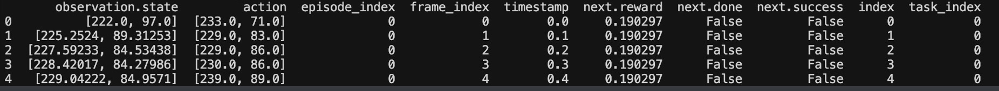

  | 列名                  | 含义                                                         |
  | --------------------- | ------------------------------------------------------------ |
  | **observation.state** | 当前状态向量（例如：电机的位置/角度）。这里是 `[x, y]` 形式，可能是某个物体在图像中的坐标位置。 |
  | **action**            | 机器人执行的动作。通常是控制信号，比如移动目标的偏移量或电机角度变更 |
  | **episode_index**     | 当前数据属于第几个 episode（第几段轨迹）                     |
  | **frame_index**       | 当前是该 episode 中的第几帧（从 0 开始）                     |
  | **timestamp**         | 时间戳，单位为秒，表示该帧相对于 episode 起始的时间          |
  | **next.reward**       | 当前动作执行后，**下一帧（next）**获得的奖励值               |
  | **next.done**         | 下一帧是否是 episode 的结束帧                                |
  | **next.success**      | 下一帧是否任务成功完成                                       |
  | **index**             | 当前样本在整个数据集中的索引编号（全局唯一）                 |
  | **task_index**        | 当前帧对应的任务编号（任务说明见 `tasks.jsonl`）             |

- videos数据集

  - `episode_000000.mp4` `episode_000030.mp4` 


3. LeRobot 项目定义的 **`LeRobotDataset` 数据集格式的官方说明**，这个格式是为了在强化学习（RL）与机器人学习任务中，统一处理视觉、动作、状态等信息而设计的。

- `hf_dataset`：这是**主数据表**（基于 Hugging Face datasets 库）： 每条数据代表一个**时刻帧**，字段举例如下：

  | 字段名                        | 含义                               | 类型                   |
  | ----------------------------- | ---------------------------------- | ---------------------- |
  | `observation.images.cam_high` | 图像帧（mp4 视频中的某帧）         | VideoFrame（带时间戳） |
  | `observation.state`           | 当前机器人状态（如关节角度、位置） | list[float32]          |
  | `action`                      | 期望控制目标（如目标关节位置）     | list[float32]          |
  | `timestamp`                   | 当前帧在该 episode 中的时间        | float32                |
  | `episode_index`               | 当前帧属于哪个 episode             | int64                  |
  | `frame_index`                 | 在该 episode 中的帧编号，从 0 开始 | int64                  |
  | `next.done`                   | 这一帧是否是 episode 的最后一帧    | bool                   |
  | `index`                       | 在整个数据集中的全局索引           | int64                  |

2. 本项目复现安装，[代码下载]()

   ```bash
   cd lerobot
   conda create -y -n lerobot python=3.10
   conda activate lerobot
   
   conda install ffmpeg
   pip install --no-binary=av -e .
   pip install -e ".[aloha, pusht]"
   pip install -e".[dynamixel]"  # 
   ```

## 机械臂硬件介绍

1. 硬件分析 koch机械臂

- **舵机（Servo Motor）** 

  - 是一种可以精确控制角度、速度和位置的**电动执行器**，你可以把它想象成“会转动的关节”。

  - 它主要包括：

    - **电机（Motor）**：负责转动。
    - **减速齿轮**：让转动更稳定、力量更大。
    - **位置传感器（通常是电位器）**：实时告诉控制器现在角度是多少。
    - **控制电路板**：接收外部指令，计算需要转动到哪个角度。

  - 一个**标准舵机**（比如你说的 FEETECH 飞特串行总线舵机）内部通常包含这几部分：

    - **电机（Motor）**：驱动装置，用来“动”

    - **减速齿轮组**：降低转速、提高扭矩（让舵机更稳更有力）

    - **编码器（Encoder）或电位器（Potentiometer）**：用来测量当前的角度/位置

    - **控制板（Control Circuit）**：

      - 接收控制指令（比如目标角度是 90°）

      - 读取编码器实时位置

      - 计算当前误差

      - 输出控制信号驱动电机，调整位置

    所以，**编码器就是舵机的“眼睛”**，而控制板就是它的“大脑”。

- 闭环控制流程可以这样理解

  目标角度（例如 90°）—   控制板发出驱动电机的命令  — 电机开始转动 — 编码器实时测量角度 — 控制板根据“实际角度 vs 目标角度”的差异 — 进行 PID 调整 — 直到误差为 0

  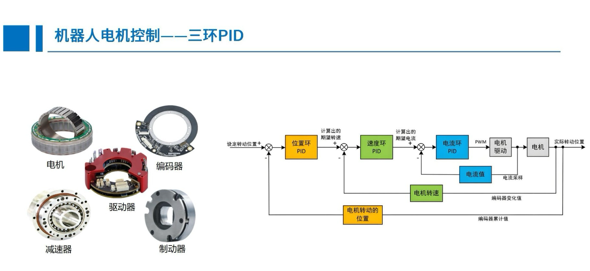

- 在机器人/机械臂中常见的情况：

  - **小关节使用空心杯电机**：重量轻，惯量小，适合高速运动（比如手指、手腕）
  - **大关节使用舵机或伺服电机+减速器**：需要扭矩大，结构稳

- 微雪 串口总线舵机驱动板模块

  - 它主要完成这几项功能：

    | 功能类别   | 作用说明                                                     |
    | ---------- | ------------------------------------------------------------ |
    | 协议转换   | 把电脑或控制器发出的串口指令（比如 USB 或 TTL）**转换成舵机能理解的控制协议**（比如 FEETECH 协议、Dynamixel 协议等） |
    | 接口适配   | 电脑是 USB，舵机是串口；树莓派是 TTL，舵机是半双工串口…它能完成**各种接口电平转换、半/全双工转换** |
    | 电源管理   | 给舵机**统一供电**，有时候还能保护舵机不被烧毁（限压、过流保护） |
    | 多舵机通信 | 支持多个舵机串联，**轮询通信、分发控制指令、采集反馈数据**   |

  - 所以在人形机器人（humanoid robot）中，驱动板也绝对是标配！ 人形机器人有很多舵机（腿、胳膊、头部）

    - 每个舵机控制一个关节（例如膝关节、肩关节等）
    - 全部舵机通过驱动板串起来
    - 控制器（比如 Jetson、树莓派）发指令给驱动板
    - 驱动板将指令转换为串口命令，发给每个舵机
    - 舵机内部的编码器实时反馈状态 → 经过驱动板回传给上位机

  - 整体流程

    | 概念             | 解释                                                         |
    | ---------------- | ------------------------------------------------------------ |
    | 上位机（Host）   | 通常就是你的**电脑、Jetson、树莓派、STM32主控板**，发指令、接收反馈 |
    | 驱动板（中间桥） | 转换信号、分发控制、采集反馈                                 |
    | 舵机（执行器）   | 接收角度/速度指令，执行动作并用编码器反馈状态                |

- 硬件的连接：

  - **舵机0**

    - TTL 接口1：连接主控板 TTL

    - TTL 接口2：连接舵机1

  - **舵机1**

    - TTL 接口1：连接舵机0

    - TTL 接口2：**空置**（没有再接舵机2）

  - **舵机2**

  - TTL 接口1：
    - D：接主控板 TTL 的 D 线，主控板的这个TTL的V、G连接右侧的降压模块；
    - V、G：接右侧降压模块
  - TTL 接口2：连接舵机3

  - **舵机3 → 舵机4 → 舵机5**：串联连接（TTL 接口连下一个舵机）
  
- 链路 A（主控板直连，12V供电）：

  - 主控板 TTL接口1
      └→ 舵机0 → 舵机1（舵机1有一个TTL闲置，没有继续连）

- 链路 B（主控板只给信号，电压来自蓝色降压模块）

  主控板 TTL接口2 的 D线（信号线）
    └→ 舵机2 → 舵机3 → 舵机4 → 舵机5
               └→ V、G供电来自右侧蓝色降压板（5~8V输出）

## 机器人初步部署和测试

1. 机械臂安装—[WowRobo](https://wowrobo.com) 机械臂

- 机械臂的选择

  - 选择已经装好的机械臂[WowRobo](https://wowrobo.com/tutorial)，Dynamixel舵机，双臂套餐4398元，机械臂是安装好的，从机械臂的主控板和舵机1需要自己插入TTL连接线，以及底座的螺丝安装，主机械臂是安装好的
  - 也可以选择自己组装机械臂，可以看[哔哩哔哩相关教程](不到一千七百元，搭出自己的lerobot-aloha真实机械臂材料清单)，两个机械臂总共2000元不到；

- 机械臂安装

  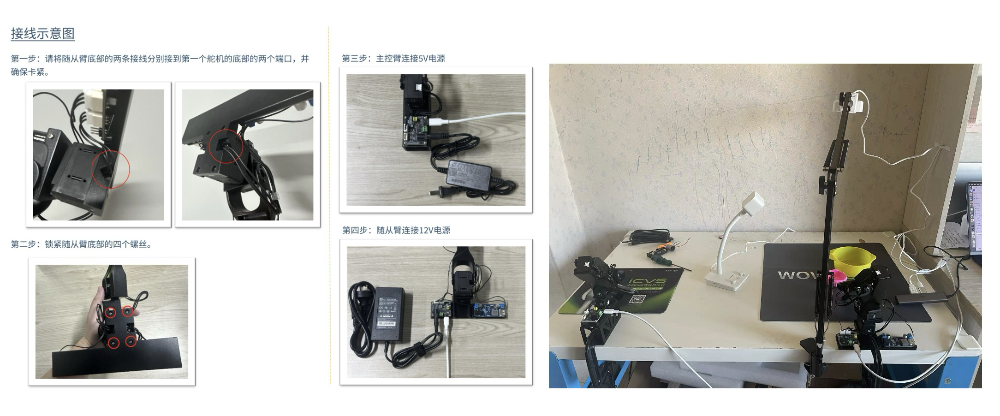

2. 统一USB接口（针对linux系统，MacOS系统接口不变，不需要绑定，只需要在koch.yaml中配置相应端口即可）

- USB 设备的端口号可能会根据设备插入的物理端口位置不同而发生变化。这是因为 Linux 系统会根据设备的插入顺序或 USB 端口来分配 `/dev/ttyACM*` 或 `/dev/ttyUSB*` 等设备文件的名称。所以每次机械臂插拔时，系统可能会分配不同的端口号，比如 `ttyACM0`、`ttyACM1` ，所以需要固定主从机械臂的usb端口，方便后续程序，下面把主从机械臂的USB设备端口固定到：

  ```
  /dev/ttyACM10 #主机械臂
  /dev/ttyACM11 #从机械臂 
  ```

- **查找设备信息**，通过插拔主从机械臂的usb口，按照这个`ls /dev/ttyACM*`返回值的差异找到其对应的机械臂USB端口；

  ```
  (base) lily@lilyhuang:~/code/xbot/lerobot$ ls /dev/ttyACM*
  /dev/ttyACM0  /dev/ttyACM1  /dev/ttyACM2  /dev/ttyACM3
  ```

- 查找出的对应关系（不同安装位置，其结果不同）
  主机械臂：`/dev/ttyACM1`

  从机械臂：`/dev/ttyACM2`

- 运行`udevadm info -a -n /dev/ttyACM1`和`udevadm info -a -n /dev/ttyACM2`分别查找如下字段：

  ATTRS{idVendor}（设备供应商ID）

  ATTRS{idProduct}（设备产品ID）

  ATTRS{serial}（设备序列号 ，用于区分同型号设备）字段

- **创建udev规则文件**：

  ```bash
  sudo gedit /etc/udev/rules.d/99-usb-serial.rules
  ```

- 在文件中添加以下内容：

  ```
  # 主臂设备绑定到 ttyACM10 
  SUBSYSTEM=="tty", ATTRS{idVendor}=="1a86", ATTRS{idProduct}=="55d3", ATTRS{serial}=="5970072559", SYMLINK+="ttyACM10"
  
  # 从臂绑定到 ttyACM11
  SUBSYSTEM=="tty", ATTRS{idVendor}=="1a86", ATTRS{idProduct}=="55d3", ATTRS{serial}=="5970072755", SYMLINK+="ttyACM11"
  ```

- **重启udev服务**：保存规则文件后：

  ```bash
  sudo udevadm control --reload-rules
  sudo udevadm trigger
  ```

- **验证结果**：

  ```bash
  (base) lily@lilyhuang:~/code/xbot/lerobot$ ls -l /dev/ttyACM10 /dev/ttyACM11
  lrwxrwxrwx 1 root root 7  4月 12 13:35 /dev/ttyACM10 -> ttyACM1
  lrwxrwxrwx 1 root root 7  4月 12 13:35 /dev/ttyACM11 -> ttyACM2
  ```

- **自动给端口开权限**：在~/.bashrc或~/.zshrc中添加

  ```bash
  sudo chmod 777 /dev/ttyACM10  # leader
  sudo chmod 777 /dev/ttyACM11  # follower
  ```

  重新打开终端，或source以下环境

3. 列出并配置电机（以下测试在终端的python代码中运行即可）

- 交互式终端中执行下面的代码。以下代码在终端中进入终端输入`python`进入python环境，然后将下面的脚本输入到终端中执行，需要在`lerobot`目录下：

  ```python
  from lerobot.common.robot_devices.motors.dynamixel import DynamixelMotorsBus
  
  leader_port = "/dev/ttyACM10"  # 主，上面绑定的端口，通过该端口与机械臂通信。
  follower_port = "/dev/ttyACM11"  # 从，上面绑定的端口
  
  # leader_arm 和 follower_arm 都是 DynamixelMotorsBus 类的实例，表示分别连接在 /dev/ttyACM10 和 /dev/ttyACM11 端口的主臂和从臂。
  leader_arm = DynamixelMotorsBus(
      port=leader_port,
      motors={
          # name: (index, model)
          "shoulder_pan": (1, "xl330-m077"), # 主机械臂的6个舵机型号是一样的，5v供电
          "shoulder_lift": (2, "xl330-m077"),
          "elbow_flex": (3, "xl330-m077"),
          "wrist_flex": (4, "xl330-m077"),
          "wrist_roll": (5, "xl330-m077"),
          "gripper": (6, "xl330-m077"),
      },
  )
  
  follower_arm = DynamixelMotorsBus(
      port=follower_port,
      motors={
          # name: (index, model)
          "shoulder_pan": (1, "xl430-w250"), # 从机械臂的舵机型号不一样，下面2个需要12v供电，上面4个需要5v供电，所以主从机械臂TTL接线不一样
          "shoulder_lift": (2, "xl430-w250"),
          "elbow_flex": (3, "xl330-m288"),
          "wrist_flex": (4, "xl330-m288"),
          "wrist_roll": (5, "xl330-m288"),
          "gripper": (6, "xl330-m288"),
      },
  )
  ```

- 连接主臂和从臂，在上面的交互式窗口继续运行：

  ```python
  leader_arm.connect()
  follower_arm.connect()
  ```

- **使用 DynamixelMotorsBus 进行读写**

  - 机器人的电机默认是从base_link往上从0到5依次排序的(代码中是1-6），要熟悉如何`DynamixelMotorsBus`与电机通信，你可以从读取电机数据开始。在同一个交互式 Python 会话中复制此代码：

  ```python
  # Present_Position 是 Dynamixel 电机的一个寄存器，它存储电机的当前位置（通常是电机的编码器值）。
  # 这个命令请求从主臂（leader_arm）的所有电机读取当前位置数据。
  leader_pos = leader_arm.read("Present_Position")
  print(leader_pos) # [2007 2226 2271 2363 1700 2126]
  
  # 这个命令请求从从臂（follower_arm）的所有电机读取当前位置数据。
  follower_pos = follower_arm.read("Present_Position")
  print(follower_pos) # [2026 2494 2301 2288 2045 2005]
  ```

  - 从机械臂上力矩，运行下面的代码后，从机械臂6个舵机将不能自由转动，所有连接到控制总线的舵机（电机）都会受到控制

  ```python
  # TorqueMode 是一个枚举类型，定义了不同的力矩模式，通常用于控制 Dynamixel 电机的工作模式，特别是如何启用或禁用力矩控制。
  from lerobot.common.robot_devices.motors.dynamixel import TorqueMode
  # 这行代码向从臂电机发送了一个命令，启用了 力矩模式。
  # Torque_Enable 是 Dynamixel 电机的一个寄存器，控制是否启用电机力矩功能。当该寄存器被启用时，电机将开始提供力矩（即应用实际的推力或旋转力）。
  follower_arm.write("Torque_Enable", TorqueMode.ENABLED.value)
  ```

- debug方式调试各个关节的状态值，在python交互式中，运行下面每一步代码，观察从机械臂运动

  ```python
  import torch
  # Get the current position
  # 返回6个点击的编码器位置
  position = follower_arm.read("Present_Position")
  # position = torch.tensor([ 0.87891,  187.12,  179.38,  44.912,  1.3184,-0.099305])
  # Update first motor (shoulder_pan) position by +10 steps
  # step1：第一个舵机（position[0]）的位置增加了10
  # 通过 follower_arm.write("Goal_Position", position)，它将更新后的目标位置发送给机械臂，让电机按照这个新的目标位置移动。
  position[0] += 10
  follower_arm.write("Goal_Position", position)
  
  # Update all motors position by -30 steps
  # step2: 重新读取机械臂当前的位置 position，然后将每个电机的位置都减少了30
  position = follower_arm.read("Present_Position")
  position -= 30
  follower_arm.write("Goal_Position", position)
  
  # Update gripper by +30 steps
  # step3: position[-1] += 30：将夹爪的位置增加了30
  position = follower_arm.read("Present_Position")
  position[-1] += 30
  follower_arm.write("Goal_Position", position[-1], "gripper")
  ```

- 解除力矩

  ```python
  from lerobot.common.robot_devices.motors.dynamixel import TorqueMode
  follower_arm.write("Torque_Enable", TorqueMode.DISABLED.value)
  ```

## 主从臂零位校准

1. 标定的目的：

   当涉及到主从机械臂时，标定的目的通常是使得主机械臂的运动与从机械臂之间能够精确地映射。也就是说，通过标定，从机械臂的每个关节与主机械臂的相应关节之间建立起一个精确的映射关系。标定文件中的电机读数（如 `start_pos` 和 `end_pos`）确保了每个电机在主从同步操作时的精确位置，以便主机械臂发出指令时，从机械臂能够正确响应并执行精确的动作。

2. 详细解析标定文件内容 

- motor_names (电机名称)：

  - 这个字段列出了机械臂中各个电机的名称，标定文件中的其他参数（如 homing_offset、drive_mode、start_pos 等）都与这些电机对应。

  - 在6自由度（DOF）机械臂中，通常会有如下的电机：

    shoulder_pan：肩部水平旋转电机

    shoulder_lift：肩部俯仰电机

    elbow_flex：肘部弯曲电机

    wrist_flex：腕部俯仰电机

    wrist_roll：腕部滚动电机

    gripper：夹爪电机

- 每个点击的标定参数都包含以下内容：

  - homing_offset (零点偏移)：

    - 这个参数定义了电机的零点偏移，单位为“步数”。它告诉控制系统，为了让电机达到标定目标位置（如0°或90°），需要做多少步数的修正。
    - 零点偏移在实际应用中通常用于补偿电机的机械误差或安装误差。每个电机都有可能存在轻微的机械差异，零点偏移用于调整这些差异，使得每个电机的“零位置”都能一致。

  
  - drive_mode (驱动方向)：
    - 这个参数表示电机的驱动方向。在标定文件中，0代表电机按正常方向运行，而1表示电机需要反转方向。
    - 驱动方向的调整通常用于某些电机反转情况，特别是机械臂结构可能导致一些关节正向和反向定义相反，反转电机的驱动方向确保机械臂运动符合预期。
  - start_pos (起始位置)：
    - 这个值表示标定过程开始时的电机读数。通常，标定时需要将电机移动到一个已知的“零位”或起始位置。
    - 在机械臂的标定中，起始位置可能对应于机械臂的某个关节的“基准位置”（例如：0°或90°），通过设定起始位置来确保标定从已知的位置开始。

  - end_pos (结束位置)：
    - 这是在标定过程中的另一关键位置，表示标定时手动移动到的“旋转位”，通常是关节的一个预定位置（如90°）。
    - 标定文件中的结束位置帮助计算机械臂运动范围内的电机步数，以便优化控制器的运动命令。

  - calib_mode (标定模式)：
    - 标定模式定义了关节的类型。对于旋转关节，使用 DEGREE 模式（通常表示旋转角度范围为[-180°，180°]）；对于线性关节，使用 LINEAR 模式（通常表示从0到100的范围，可能对应于关节的长度或某种线性度量）。
    - 这区分了不同类型的关节，从而能够针对每种关节类型使用不同的标定策略。

3. 标定过程

- 运行代码，按照每一步调整主从臂的相机位置：

  ```bash
  python lerobot/scripts/calibration.py 
  # 会出现以下结果，根据提示进行follower和leader的标定
  (lerobot) lily@lilyhuang:~/code/xbot/lerobot$ python lerobot/scripts/calibration.py 
  Connecting main follower arm.
  Connecting main leader arm.
  Missing calibration file '.cache/calibration/koch/main_follower.json'
  
  Running calibration of koch main follower...
  
  Move arm to zero position
  See: https://raw.githubusercontent.com/huggingface/lerobot/main/media/koch/follower_zero.webp
  Press Enter to continue...
  
  Move arm to rotated target position
  See: https://raw.githubusercontent.com/huggingface/lerobot/main/media/koch/follower_rotated.webp
  Press Enter to continue...
  
  Move arm to rest position
  See: https://raw.githubusercontent.com/huggingface/lerobot/main/media/koch/follower_rest.webp
  Press Enter to continue...
  
  Calibration is done! Saving calibration file '.cache/calibration/koch/main_follower.json'
  Missing calibration file '.cache/calibration/koch/main_leader.json'
  
  Running calibration of koch main leader...
  
  Move arm to zero position
  See: https://raw.githubusercontent.com/huggingface/lerobot/main/media/koch/leader_zero.webp
  Press Enter to continue...
  
  Move arm to rotated target position
  See: https://raw.githubusercontent.com/huggingface/lerobot/main/media/koch/leader_rotated.webp
  Press Enter to continue...
  
  Move arm to rest position
  See: https://raw.githubusercontent.com/huggingface/lerobot/main/media/koch/leader_rest.webp
  Press Enter to continue...
  
  Calibration is done! Saving calibration file '.cache/calibration/koch/main_leader.json'
  Activating torque on main follower arm.
  已经标定过了, 请检查标定是否成功
  [  8.349609  115.927734  172.88086   -18.984375   -3.8671875   5.5371094]
  [-10.283203  121.9043    167.69531     2.1972656  -2.1972656  17.402344 ]
  对比leader和follower的关节参数,相差不大则说明标定成功
  ```

- 主从机械臂的摆放位置对应图：

  <table>
    <tr>
      <td colspan="3" align="center"><strong>从机械臂 koch main follower</strong></td>
    </tr>
    <tr>
      <td align="center">
        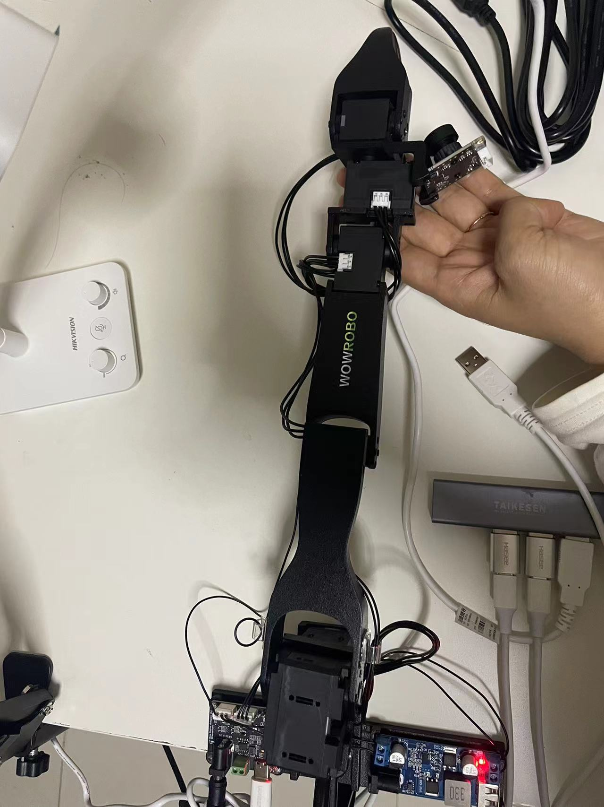<br><strong>zero position</strong>
      </td>
      <td align="center">
        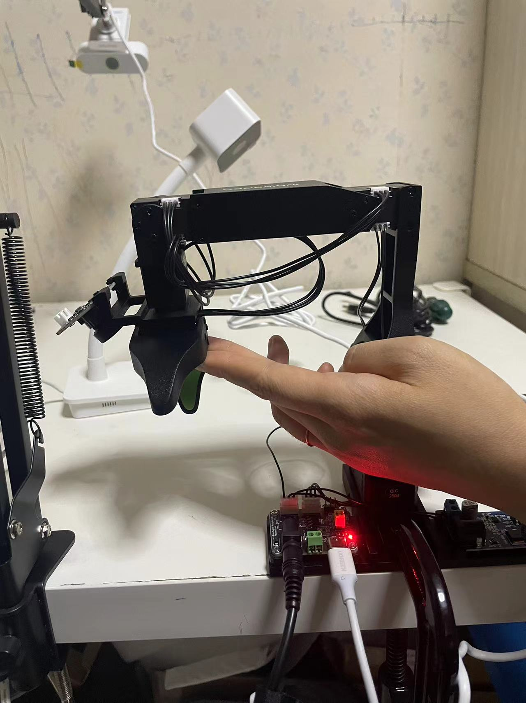<br><strong>rotated target position</strong>
      </td>
      <td align="center">
        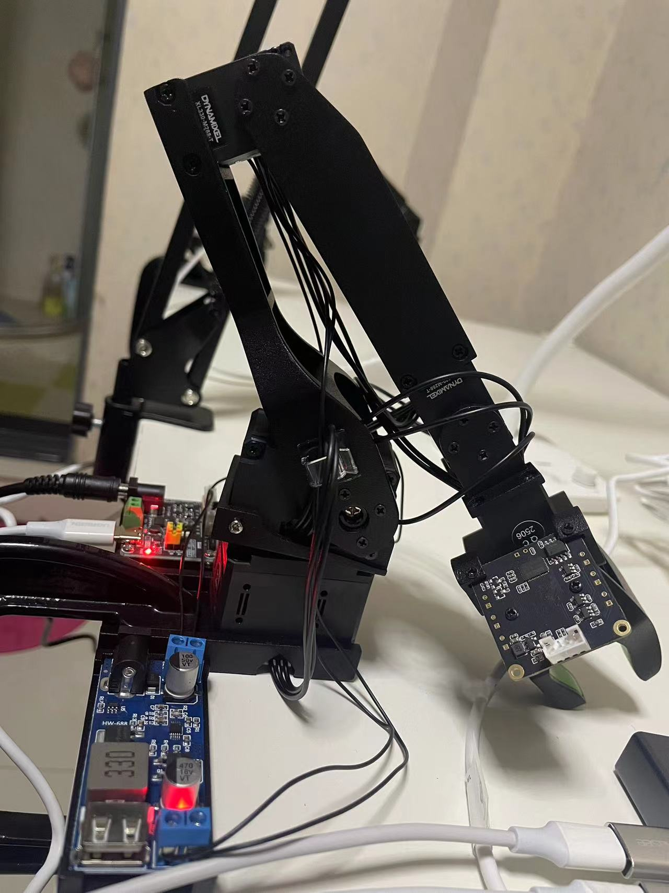<br><strong>rest position</strong>
      </td>
    </tr>
    <tr>
      <td colspan="3" align="center"><strong>主机械臂 koch main leader</strong></td>
    </tr>
    <tr>
      <td align="center">
        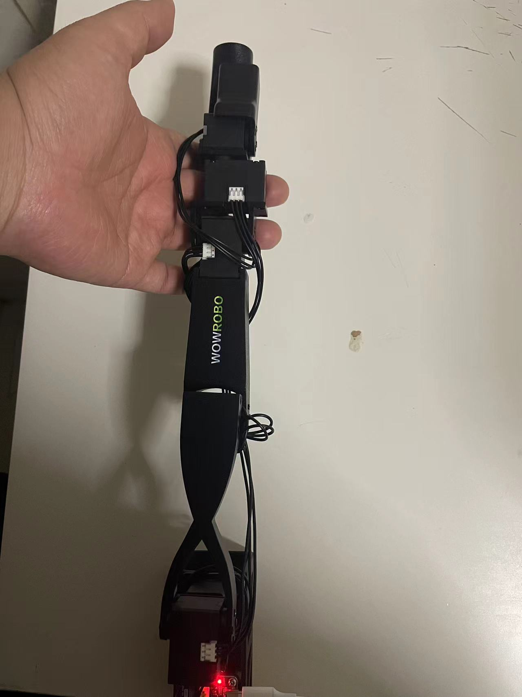<br><strong>zero position</strong>
      </td>
      <td align="center">
        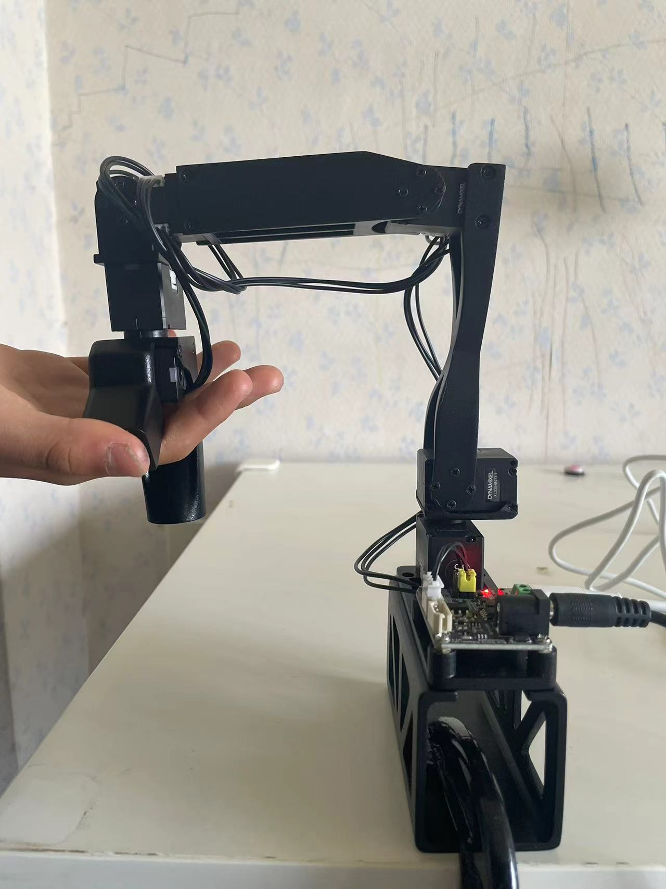<br><strong>rotated target position</strong>
      </td>
      <td align="center">
        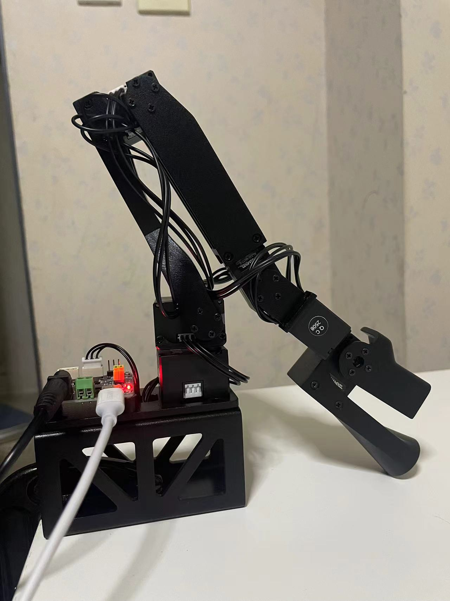<br><strong>rest position</strong>
      </td>
    </tr>
  </table>
  
- 标定完成会产生两个文件：`.cache/calibration/koch/main_leader.json`和`.cache/calibration/koch/main_follower.json`

  ```json
  # .cache/calibration/koch/main_leader.json
  {
    "homing_offset": [2048, 3072, -1024, 3072, 1024, -2048],
    "drive_mode": [1, 1, 0, 1, 0, 0],
    "start_pos": [2020, 3085, 935, 3116, -1033, 1923],
    "end_pos": [-1000, -2096, 2014, -2019, 93, 2658],
    "calib_mode": ["DEGREE", "DEGREE", "DEGREE", "DEGREE", "DEGREE", "DEGREE"],
    "motor_names": ["shoulder_pan", "shoulder_lift", "elbow_flex", "wrist_flex", "wrist_roll", "gripper"]
  }
  
  # .cache/calibration/koch/main_follower.json
  {
    "homing_offset": [-2048, 3072, 3072, 3072, 3072, -2048],
    "drive_mode": [0, 1, 1, 1, 1, 0],
    "start_pos": [2009, 3043, 3045, 3154, 2958, 2003],
    "end_pos": [3081, -2046, -2030, -2016, -2040, 3024],
    "calib_mode": ["DEGREE", "DEGREE", "DEGREE", "DEGREE", "DEGREE", "DEGREE"],
    "motor_names": ["shoulder_pan", "shoulder_lift", "elbow_flex", "wrist_flex", "wrist_roll", "gripper"]
  }
  
  ```

- 标定验证，最后的休息位置需要摆放到位，特别是最后一个舵机6，放正，不然会影响判定结果，以下代码是检测reset位置的主从机械臂的位置，来对比位置差异，每个机械臂差异<10，可以接受，不然重新标定。（这个只能简单定性评估）

  ```python
  #注意，下面代码会读取calibration_dir文件夹下是否有main_leader.json和main_follower.json文件，如果有的则不会进行calibration
  calibration_dir = ".cache/calibration/koch"
  # 判断文件夹下是否有main_leader.json和main_follower.json文件
  if os.path.exists(os.path.join(calibration_dir, "main_leader.json")) and os.path.exists(os.path.join(calibration_dir, "main_follower.json")):
      print("已经标定过了, 请检查标定是否成功")
  
      leader_pos = robot.leader_arms["main"].read("Present_Position")
      
      follower_pos = robot.follower_arms["main"].read("Present_Position")
  
      print(leader_pos) # 结果： [ -3.7792969 134.91211   176.57227     0.9667969   1.3183594  17.138672 ]
      print(follower_pos)# 结果：[ -5.0976562 127.177734  173.4082     -2.3730469  -0.703125   10.8984375]
      print("对比leader和follower的关节参数,相差不大则说明标定成功")
  ```
  
  | 关节              | 主臂 (度) | 从臂 (度) | 差异 (度) |
  | ----------------- | --------- | --------- | --------- |
  | 1 (shoulder_pan)  | -3.78     | -5.10     | 1.32      |
  | 2 (shoulder_lift) | 134.91    | 127.18    | 7.73      |
  | 3 (elbow_flex)    | 176.57    | 173.41    | 3.16      |
  | 4 (wrist_flex)    | 0.97      | -2.37     | 3.34      |
  | 5 (wrist_roll)    | 1.32      | -0.70     | 2.02      |
  | 6 (gripper)       | 17.14     | 10.90     | 6.24      |
  
- 标定完毕后，是上力矩状态，此时可以用手去感受一下，从臂舵机是不可以自由旋转的，需要释放力矩，运行以下代码，操作过程中，要经常释放力矩：

  ```bash
  python lerobot/scripts/release_torque.py #释放力矩，运行过程中要经常释放力矩
  ```

4. 测试遥操作

- 在`lerobot/scripts/teleopration.py`文件中，先注释掉`camera`的部分
- 执行遥操作代码：`python lerobot/scripts/teleopration.py`
- 操作主臂，从臂跟着运动，说明成功


## 摄像头数据获取与检验

1. 摄像头测试：

- 运行以下代码`python find_camera_port.py`，找到摄像头的端口号，我使用的摄像头端口号是2和4：

  ```bash
  (lerobot) lily@lilyhuang:~/code/xbot/lerobot$ python find_camera_port.py 
  欢迎使用摄像头测试程序！
  操作说明：请你将鼠标光标点击弹出图像然后按照下面提示切换摄像头
    - 按 'n' 切换到下一个摄像头
    - 按 'q' 随时退出程序
  正在搜索可用摄像头...
  
  Linux detected. Finding available camera indices through scanning '/dev/video*' ports
  Camera found at index /dev/video0
  Camera found at index /dev/video2
  Camera found at index /dev/video4
  找到以下摄像头端口: [0, 2, 4]
  共检测到 3 个摄像头，开始测试...
  
  
  正在测试摄像头 0:
    - 按 'n' 切换到下一个摄像头
    - 按 'q' 退出程序
  
  正在测试摄像头 2:
    - 按 'n' 切换到下一个摄像头
    - 按 'q' 退出程序
  
  正在测试摄像头 4:
    - 按 'n' 切换到下一个摄像头
    - 按 'q' 退出程序
  
  所有摄像头测试完成或已退出
  ```

- 调整摄像头的视角，基本达到如下范围：

  <table border="1" cellspacing="0" cellpadding="6" width="100%">
    <tr>
      <td align="center"><strong>laptop</strong></td>
      <td align="center"><strong>phone</strong></td>
    </tr>
    <tr>
      <td align="center">
        <br>
      </td>
      <td align="center">
        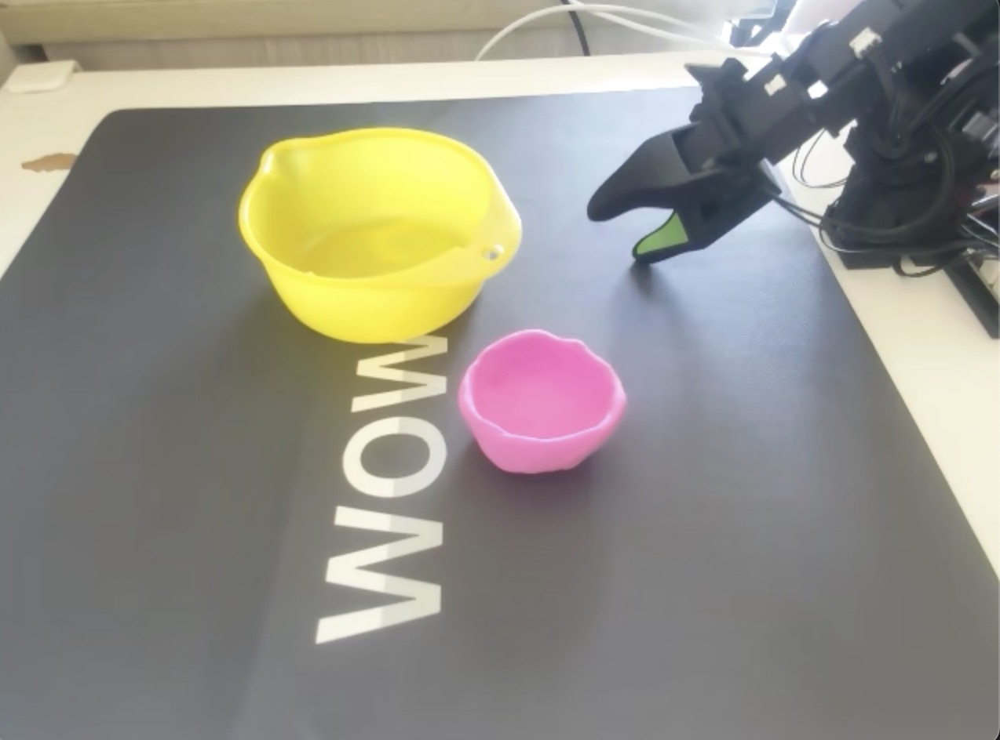<br>
      </td>
    </tr>
  </table>

- 配置端口号到`lerobot/configs/robot/koch.yaml`文件，目前使用2个摄像头，其它可按照同样的方法配置

  ```yaml
  cameras:
    laptop:
      _target_: lerobot.common.robot_devices.cameras.opencv.OpenCVCamera
      camera_index: 0 #此处要和python find_camera_port.py结果的摄像头端口号对应，比如我MacOS系统的是0、1
      fps: 30
      width: 640
      height: 480
    phone:
      _target_: lerobot.common.robot_devices.cameras.opencv.OpenCVCamera
      camera_index: 1 #此处要和python find_camera_port.py结果的摄像头端口号对应，比如我MacOS系统是0、1
      fps: 30
      width: 640
      height: 480
    # wrist:
    #   _target_: lerobot.common.robot_devices.cameras.opencv.OpenCVCamera
    #   camera_index: 6
    #   fps: 30
    #   width: 640
    #   height: 480
    # front:
    #   _target_: lerobot.common.robot_devices.cameras.opencv.OpenCVCamera
    #   camera_index: 0
    #   fps: 30
    #   width: 640
    #   height: 480
    # side:
    #   _target_: lerobot.common.robot_devices.cameras.opencv.OpenCVCamera
    #   camera_index: /dev/video2
    #   fps: 30
    #   width: 640
    #   height: 480       
  
    # top:
    #   _target_: lerobot.common.robot_devices.cameras.opencv.OpenCVCamera
    #   camera_index: /dev/video4
    #   fps: 30
    #   width: 640
    #   height: 480
    # wrist:
    #   _target_: lerobot.common.robot_devices.cameras.opencv.OpenCVCamera
    #   camera_index: 6
    #   fps: 30
    #   width: 640
    #   height: 480
  ```

- 注：如果出现摄像头端口频繁改变的问题，可以按照前面机械臂的端口号映射到固定端口号方法，没有这个现象则不用，也可以每次检查，发现有变化，在`lerobot/configs/robot/koch.yaml`重新配置，MacOS系统默认最后一个是内置摄像头，所以是不变的。

2. 摄像头数据获取：

- 运行下面指令查看在`outputs/images_from_opencv_cameras`下有没有生成文件

  ```bash
  python lerobot/common/robot_devices/cameras/opencv.py
  ```

## 遥操作数据采集

**建议用Cursor、winsurf、copilot等工具，遇到问题可以快速解决**

1. 录制训练数据

- 测试能否跑通遥操作

  ```bash
  python lerobot/scripts/control_robot.py teleoperate --robot-path lerobot/configs/robot/koch.yaml
  ```

- 采集数据集

  - 数据推送到huggingface，必须在当前环境中登录

  ```bash
  huggingface-cli login --token hf_token--add-to-git-credential
  HF_USER=$(huggingface-cli whoami | head -n 1)
  echo $HF_USER
  ```

  - 数据采集

  ```bash
  python lerobot/scripts/control_robot.py record \   # 运行control_robot.py中record子命令
      --robot-path lerobot/configs/robot/koch.yaml \
      --fps 30 \
      --root data \                                  # 本地文件夹
      --repo-id $HF_USER/koch_clip_clay_bowl \       # 文件夹下的目录，hugging face中也是这种目录
      --tags koch tutorial \
      --warmup-time-s 5 \                            # 预热时间，以防前几帧图片质量不好
      --episode-time-s 20  \                         # 一个episode的时间，s，遥操动作做完的时间；
      --reset-time-s 10  \                           # 把场景人为复原的时间
      --num-episodes 50  \                           # 采集的数据量
      --push-to-hub 1 \                              # 是否上传到hugging face， 0-否，1-是
      --force-override 0                             # 采集数据是否覆盖之前的数据；
  ```

- lerobot官方的数据集[pushts]()数据集：

  ```bash
  ── data
  │   └── chunk-000
  │       ├── episode_000000.parquet
  │       ├── episode_000001.parquet
  │       ├── episode_000002.parquet
  │       ├── episode_000003.parquet
  ├── meta
  │   ├── episodes.jsonl
  │   ├── episodes_stats.jsonl
  │   ├── info.json
  │   └── tasks.jsonl
  ├── tree.sh
  ├── tree.shy
  └── videos
      └── chunk-000
          └── observation.image
              ├── episode_000000.mp4
              ├── episode_000001.mp4
              ├── episode_000002.mp4
  
  ```

- 我生成数据集：

  ```
  └── koch_clip_clay_bowl
      ├── episodes
      │   ├── data_recording_info.json
      │   ├── episode_0.pth
      │   ├── episode_1.pth
      │   ├── episode_2.pth
      │   ├── episode_3.pth
      ├── meta_data
      │   ├── episode_data_index.safetensors
      │   ├── info.json
      │   └── stats.safetensors
      ├── train
      │   ├── data-00000-of-00001.arrow
      │   ├── dataset_info.json
      │   └── state.json
      └── videos
          ├── observation.images.laptop_episode_000000.mp4
          ├── observation.images.laptop_episode_000001.mp4
          ├── observation.images.laptop_episode_000002.mp4
  ```

- 此时生成的数据集是原始的数据集，可以让`cursor`写一个脚本转换为hugging face的标准数据集

- rerun.io展示数据集：

  ```bash
  python lerobot/scripts/visualize_dataset.py \
      --root data
      --repo-id Lily-Huang/koch_clip_clay_bowl \
      --episode-index 0
  # rerun.io打开数据，主要看state和action叠加的这样图，下图第一个，如果基本重合说明数据质量较好。
  ```

  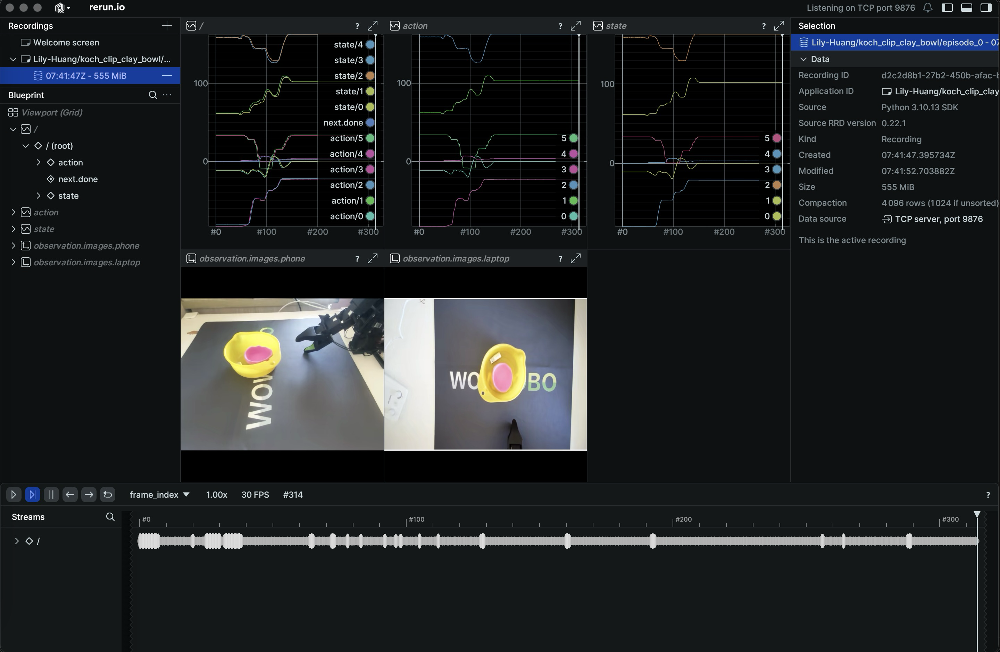

- 重播数据(在真机上让动作重新执行，检查数据的有效性和准确性)

  ```bash
  python lerobot/scripts/control_robot.py replay \
  --robot-path lerobot/configs/robot/koch.yaml \
  --fps 30 \
  --root data \
  --repo-id Lily-Huang/koch_clip_clay_bowl \
  --episode 0  # 根据索引不同，可以重播不同数据
  ```

## ACT训练和推理完整流程

1. ACT模型策略训练

   ```bash
   python lerobot/scripts/train.py \
   dataset_repo_id=/Users/huangli/code/xbot/lerobot/data/Lily-Huang/koch_clip_clay_bowl \ #绝对路径，不然hydra会干扰出错
   env=koch_real \
   policy=act_koch_real \
   hydra.run.dir=outputs/train/koch_clip_clay_bowl \
   hydra.job.name=act_koch_test \
   device=cpu  \
   wandb.enable=false 
   ```

2. 我选自用云端训练：[AutoDL](https://autodl.com/home)，也可以用[SiliconFlow](https://siliconflow.cn/zh-cn/)硅基流动，训练过程如下：

- AutoDL，登陆可以看官方文档，我使用的是ssh登陆。
  - 我选择RTX 4090 / 24 GB，以ssh的模式登陆AutoDL，
  - 上传xbot整个包，包含采集的数据；
  - 在ssh链接的terminal端配置环境，和本地配置环境一样；
  - 主要训练参数Steps = 200000，batch_size = 32，训练时间共计35h+；

- 创建wandb API key：***

  ```bash
  # 在AutoDL的ssh新建的conda环境里
  pip install wandb
  wandb login
  
  (xbot-lerobot) root@autodl-container-98a74c9ae6-cf8447e2:~/autodl-tmp/xbot/lerobot/data/Lily-Huang/koch_clip_clay_bowl# wandb login
  wandb: Logging into wandb.ai. (Learn how to deploy a W&B server locally: https://wandb.me/wandb-server)
  wandb: You can find your API key in your browser here: https://wandb.ai/authorize
  wandb: Paste an API key from your profile and hit enter, or press ctrl+c to quit:
  wandb: No netrc file found, creating one.
  wandb: Appending key for api.wandb.ai to your netrc file: /root/.netrc
  wandb: Currently logged in as: lilyhuang to https://api.wandb.ai. Use `wandb login --relogin` to force relogin
  ```

- 训练参数的相关配置见`/lerobot/configs/policy/act_aloha_real.yaml`，主要是训练参数

  ```yaml
  # 训练配置
  training:
    offline_steps: 200000     # 离线训练的步数（这里是 200,000 步）
    online_steps: 0           # 在线训练的步数（这里设置为 0，表示没有在线训练）
    eval_freq: -1             # 评估频率，设置为 -1 表示禁用自动评估
    save_freq: 10000         # 模型保存频率（每 20,000 步保存一次），尽量大一些，不然不断的磁盘写入，会加长时间
    log_freq: 100            # 日志记录频率（每 100 步记录一次日志）
    save_checkpoint: true     # 是否保存模型检查点（设置为 true，表示保存）
  
    batch_size: 32            # 批量大小（每次训练时使用 16 个样本）
    lr: 1e-5                  # 学习率
    lr_backbone: 1e-5         # 骨干网络的学习率
    weight_decay: 1e-4        # 权重衰减（L2 正则化）
    grad_clip_norm: 10       # 梯度裁剪的阈值，用于防止梯度爆炸
    online_steps_between_rollouts: 1  # 在线回合之间的步数
  ```

- 模型训练，在AutoDL的jupyter lab的terminal执行以下代码：

  ```bash
  # 如果训练中途中断，增加一个参数resume=true，会自动last文件夹读取权重，last文件夹软连到最后一个checkpoints
  WANDB_MODE=offline python lerobot/scripts/train.py 
  dataset_repo_id=/root/autodl-tmp/xbot/lerobot/data/Lily-Huang/koch_clip_clay_bowl \ # 换成AutoDL中目录
  env=koch_real \
  policy=act_koch_real \
  hydra.run.dir=outputs/train/koch_clip_clay_bowl \
  hydra.job.name=act_koch_test \
  device=cpu  \
  wandb.enable=true # 有可能会报错，wandb的tag太长，需要修改logger.py
  ```

- wandb会根据dataset_repo_id生成tag，wandb的tag长度`between 1 and 64 characters`，`dataset_repo_id`不能相对路径，不然`hydra`会导致报错，需要修改wandb.init( )代码，为了折中，命令前加上`WANDB_MODE=offline`，训练完毕后wandb的相关log会保存在`   outputs/train/koch_clip_clay_bowl/wandb/`，然后手动上传wandb：（⚠️注：此处建议修改源代码logger.py，wandb offline后还是会报错，tag过长，应该是在二进制

  ```bash
  # 进入包含wandb目录的训练输出目录
  cd outputs/train/koch_clip_clay_bowl  
  # 同步所有离线运行
  wandb sync wandb/run-*
  ```

- 模型训练日志分析如下：

  ```yaml
  #输出信息总结
  - dataset_repo_id: '/root/autodl-tmp/xbot/lerobot/data/Lily-Huang/koch_clip_clay_bowl'这是数据集标识符。
  - device: 'cuda'说明模型将在 GPU 上训练（CUDA 是 NVIDIA GPU 加速计算的工具）。
  1. env:
    - action_dim: 6 - 动作的维度，表示模型每次选择的动作包含 6 个维度。
    - fps: ${fps} - 帧率（每秒帧数），该值由环境动态设置，通常在训练中用于控制时间步长。
    - name: 'koch' - 环境的名称，用于标识特定的训练环境。
    - state_dim: 6 - 状态的维度，表示环境中的状态空间大小。
  2. eval:
    - batch_size: 50 - 在评估阶段，每个批次的样本数量。
    - n_episodes: 50 - 评估过程中运行的回合数。
    - use_async_envs: False - 是否启用异步环境（通常用于多环境并行训练）。
  3. fps: 30 - 每秒的帧数，表示训练过程中的时间步进频率。
  4. override_dataset_stats:
    - 用于覆盖数据集的标准化统计信息，确保图像数据的标准化与预训练模型一致。这里为笔记本和手机图像分别设置了均值和标准差。
  
  #模型配置
  1. policy:
    - chunk_size: 100 - 每次处理的数据块大小，也可以理解为每次训练时样本的数量。
    - dim_feedforward: 3200 - 前馈网络的维度，用于决定前馈层的宽度。
    - dim_model: 512 - 模型的维度，指 transformer 模型的层大小。
    - dropout: 0.1 - Dropout 比例，用于避免过拟合，通常在训练中随机丢弃神经网络的部分连接。
    - feedforward_activation: 'relu' - 前馈层的激活函数，使用 ReLU（Rectified Linear Unit）作为激活函数。
    - n_encoder_layers: 4 - 编码器层的数量，指 transformer 中编码部分的层数。
    - n_decoder_layers: 1 - 解码器层的数量，实际运行时只使用第一个解码器层。
    - n_heads: 8 - 多头注意力机制中的头数。
    - n_vae_encoder_layers: 4 - 变分自编码器（VAE）的编码器层数量。
    - pretrained_backbone_weights: 'ResNet18_Weights.IMAGENET1K_V1' - 预训练权重来源于 ResNet-18 模型，
  2. training:
    - offline_steps: 200000 - 离线训练的总步数。这里指定为 8 步。
    - online_steps: 0 - 在线训练的步数，设置为 0 表示没有在线训练。
    - eval_freq: -1 - 自动评估的频率设置为 -1，表示禁用自动评估（评估过程由其他脚本控制）。
    - save_freq: 10000 - 每训练 10000 步保存一次模型检查点。
    - log_freq: 500 - 每 500 步记录一次日志。
    - save_checkpoint: True - 是否保存模型的检查点。
  3. learning rate and optimization:
    - lr: 1e-5 - 学习率（学习率通常控制模型的训练步伐）。
    - lr_backbone: 1e-5 - 骨干网络的学习率，通常可以单独为模型的某些部分设置学习率。
    - weight_decay: 1e-4 - 权重衰减，L2 正则化，用于避免模型过拟合。
    - grad_clip_norm: 10 - 梯度裁剪的阈值，防止梯度爆炸。
    - num_workers: 4 - 数据加载时使用的工作线程数。
  4. delta_timestamps:
    - action: "[i / ${fps} for i in range(${policy.chunk_size})]" -计算每个动作时间戳，基于帧率和块大小来设定。
  # 训练进度
  # 以下是训练日志输出中的参数：
  # INFO 2025-04-18 20:12:12 ts/train.py:192 step:200K smpl:6M ep:21K epch:413.31 loss:0.026 grdn:6.500 lr:1.0e-05 updt_s:0.269 data_s:0.000
  - step: 当前训练步数/迭代次数，从0开始计数
  - smpl: 当已处理的样本总数（samples），计算方式: (step + 1) * batch_size
  - ep: 已处理的训练数据集等效完整episode数量，计算方式: num_samples / avg_samples_per_ep
  - epch: 训练数据的遍历次数，数据集已被遍历约413次，计算方式: num_samples / dataset.num_samples
  - loss: 损失值（loss），衡量模型在当前步骤中的表现。较低的损失值通常意味着模型的训练效果较好。
  - grdn: 梯度的大小（gradients），用于衡量参数更新的幅度。梯度过大会导致模型训练不稳定。
  - lr: 当前的学习率。
  - updt_s: 模型参数更新耗时
  - data_s: 数据加载耗时
  ```

- 模型训练loss变化如下：

  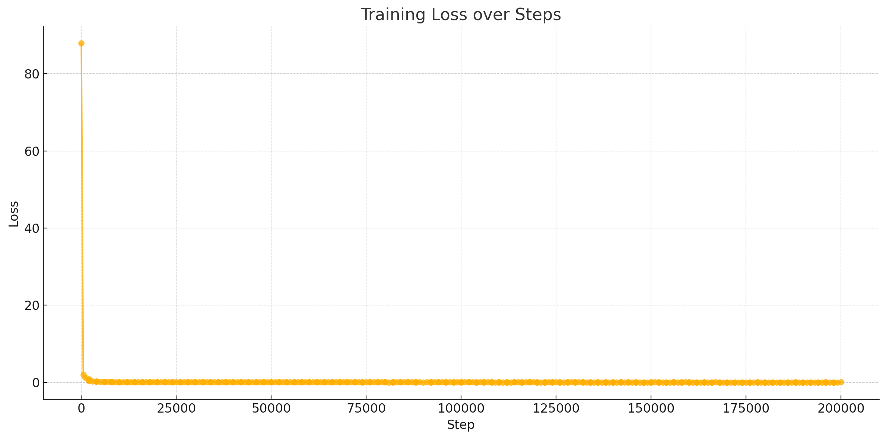

3. 第一种模型评估：实时推理(Inference)过程，把AutoDL的训练真个代码库下载到本地：

   注意要压缩文件的时候使用如下命令：`tar --dereference -cvf xbot.tar xbot`，防止软连接失效，download到本地，运行出错)

   ```bash
   # 意要压缩文件的时候使用如下命令，防止软连接失效
   tar --exclude='.DS_Store' --exclude='._*' -cvhf xbot.tar xbot/
   # 本地中断窗口拷贝AutoDL中训练好的资料
   scp -P 39210 root@connect.nmb1.seetacloud.com:/root/autodl-tmp/xbot.tar .
   ```

- 预训练模型控制机器人直接抓取测试（**一定要保证推理和采集数据时候的摄像头位置角度一致**，不然模型泛化会差）

  基于摄像头观察到的数据实时生成动作指令并执行，完全由神经网络（模型）控制机器人模型训练完毕后，就会在`outputs/train/act_koch_real`  得到checkpoints文件

  ```bash
  python lerobot/scripts/control_robot_llm.py inference \
  --robot-path lerobot/configs/robot/koch.yaml \
  --fps 10 \ # 我云端训练完毕后，需要本地推理进CPU推理，所以fps尽量调整小一些。
  --root data \
  --repo-id Lily-Huang/koch_clip_clay_bowl \
  -p outputs/train/koch_clip_clay_bowl/checkpoints/last/pretrained_model
  ```

  📺 **项目结果演示视频**

  [](https://www.youtube.com/watch?v=390EQSu6ihM)

- 实时推理(Inference)过程评估

  过程：

  - 已经有了一个预训练好的模型(基于之前录制的视频训练出来的权重文件)。
  - 在测试时，机器人打开摄像头实时观察环境
  - 模型根据摄像头画面(观察数据)生成动作，直接控制机器人完成任务
  - 效果是可以实时看到机器人基于预训练模型的表现，例如抓取目标物体的过程。

  用途:

  - 检查模型性能是否满足预期，
  - 通过观察机器人的实时行为，判断模型是否能够在实际环境中正常工作。

  看到的效果:

  - 比如机器人看到桌面上的红笔后，会自主移动机械臂，抓取红笔，然后完成任务

  - 可以进行多次抓取，计算抓取的成功率，来评价模型；

- 我的训练结果分析：

  - 模型训练的已经可以，loss得值很低，但是抓取不是很准，主要有2部分原因组成：
    - 采集的数据集太少了，抓取过程换了位置，抓取成功率比较低；
    - 推理时候较采集数据时的摄像头角度变化了，导致模型泛化能力不佳，
    - ⚠️ **摄像头位置和角度一定要一直保持不变**；

4. 第二种模型评估：记录评估过程并生成数据集

   基于推理结果自动生成新的数据集，**记录的动作数据是模型生成的动作，而不是人工的遥操作**。

   ```bash
   python lerobot/scripts/control_robot.py record \
     --robot-path lerobot/configs/robot/koch.yaml \  # 机械臂的配置文件
     --fps 30 \  # 推理帧率，30帧/秒
     --root data \  # 数据存储的根目录
     --repo-id ww12357i/eval_koch_test1 \  # 记录的数据集的命名空间
     --tags tutorial eval \  # 数据集的标签（tutorial 和 eval）
     --warmup-time-s 5 \  # 推理前的预热时间
     --episode-time-s 30 \  # 每段评估的持续时间
     --reset-time-s 10 \  # 评估结束后的重置时间
     --num-episodes 2 \  # 评估任务数量（10段任务）
     -p outputs/train/act_koch_real/checkpoints/080000/pretrained_model # 指定策略模型路径
   ```

- 记录评估数据集

  过程：

  - 仍然使用预训练好的模型（和第一种方法相同的权重文件）。

  - 机器人在模型指令下完成任务（例如抓取红笔），数据**由模型生成，而不是人工遥操作控制**。

  - 在执行任务的同时，系统会记录下：

    - 摄像头观察到的画面。

    - 模型生成的动作。

    - 机器人执行动作后的状态。

  - 记录下的数据会被保存为一个新的数据集（例如 `eval_koch_test`）。

  用途：

  - 生成评估数据集，可视化和分析推理效果。
  - 进一步训练或微调模型（例如强化学习中的新数据采样）。

  看到的效果，在生成的数据集中，你可以看到模型在推理时的表现：

  - 模型在不同观察条件下生成了什么样的动作。
  - 机器人是否能够完成任务。

## ACT原理算法流程介绍

（⚠️**注：以下描述的各数据维度不一定对，代码整理来自claud3.7**）

1. ACT作为斯坦福最新的Mobile ALOHA系统的最核心的算法：Action Chunking with Transformer。它为啥效果这么好，其实主要的就是Transformer生成式算法，在ACT中主要使用的是CVAE。

2. 首先要清楚AE、VAE、CVAE的概念，B站有甚很多教程

3. 数据集目录结构分析

   - `episodes` 目录：存储每个交互片段的PyTorch文件
   - `meta_data` 目录：包含索引和统计信息
   - `train` 目录：Arrow格式的训练数据
   - `videos` 目录：录制的视频文件

4. 相机标定方式**相机与机器人的空间关系**：

   - ACT算法不需要显式的相机标定，因为它是一个端到端的方法

   - 系统通过示范数据学习相机视角与机器人动作之间的映射关系

   - 在训练数据中，模型隐式学习了相机视角中的物体位置与所需机器人动作之间的关系

   - ACT通过以下方式实现这一点：

     通过示范数据学习视觉-运动映射：示范数据包含相机图像和对应的机器人关节角度

     模型学习了将视觉观察直接映射到关节空间动作的能力

     这避免了显式的坐标系转换和逆运动学计算

5. 总结来说，ACT算法的核心优势在于它不需要显式的相机标定或坐标系转换，而是通过端到端学习直接从原始感知数据到控制命令的映射，使机器人能够模仿人类示范的动作。

6. ACT (Action Chunking Transformer) 模型的完整数据处理流程如下：

- 1）输入数据预处理：

  ```python
  # 输入数据准备
  observation = robot.capture_observation()         # 包含相机图像和机器人状态
  normalized_data = normalize_inputs(observation)   # 数据归一化处理
  ```

  ```python
  {
      "observation": {
          "images": {
              "laptop": [T, H, W, 3], # T个时间步的图像序列
              "phone": [T, H, W, 3]
          },
          "state": [T, state_dim] # T个时间步的机器人状态
      },
      "action": [T, action_dim] # T个时间步的动作（舵机值）
  }
  ```

  - observation数据如下(rerun.io展示图的数据就是action、state、image，可以对照上面展示图看)：

    - 在时间步T，有`observation.images.laptop[t]`、`observation.images.phone[t]`、`observation.state[t]`和`action[t]`

    - `observation.state[t]`：时间步t时follower arm的实际位置
    - `action[t]`：时间步t时发送给follower arm的目标位置（来自leader arm）


  - 在训练过程中，这些数据被用来：

    训练输入：

    - 使用observation.images[t]（相机图像）
    - 使用observation.state[t]（机器人状态）

    训练目标：

    - 使用action[t]作为模型应该预测的目标


- 2）视觉特征提取

```python
# 多相机视觉特征提取
all_cam_features = []
all_cam_pos_embeds = []  # 同时保存位置编码

for camera_index in range(num_cameras):
    # 从输入图像提取特征
    image = normalized_data["observation.images"][:, camera_index]  # [B, 3, H, W]
    features = resnet_backbone(image)["feature_map"]                # [B, C, h, w]
    
    # 生成位置编码
    pos_embed = sinusoidal_position_embedding(features)             # [B, C, h, w]
    
    # 特征映射转换
    cam_features = conv1x1(features)                                # [B, D, h, w]
    
    # 分别保存特征和位置编码
    all_cam_features.append(cam_features)
    all_cam_pos_embeds.append(pos_embed)

# 拼接所有相机特征和位置编码
vision_features = concat(all_cam_features, dim=-1)                  # [B, D, h, combined_w]
vision_pos_embeds = concat(all_cam_pos_embeds, dim=-1)              # [B, D, h, combined_w]

# 转换为序列格式，即Transformer输入格式：[序列长度, 批量大小, 特征维度]
vision_tokens = reshape(vision_features, "b d h w -> (h w) b d")    # [(h*w), B, D]
vision_pos_embeds = reshape(vision_pos_embeds, "b d h w -> (h w) b d")  # [(h*w), B, D]

# 将视觉特征和其他特征一起添加到编码器输入
encoder_tokens.extend(vision_tokens)
encoder_pos_embeds.extend(vision_pos_embeds)  # 位置编码也一同加入

# 最终在Transformer编码器中使用
encoder_output = transformer_encoder(
    encoder_tokens,
    pos_embed=encoder_pos_embeds  # 这里传入位置编码
)
```

- 3）VAE仅处理动作序列

```python
# VAE编码器流程 (仅在训练时使用)
# 准备VAE编码器输入
cls_token = cls_embed_weight.repeat(batch_size, 1, 1)               # [B, 1, D]
state_token = linear_proj(observation["observation.state"])          # [B, 1, D]
action_tokens = linear_proj(observation["action"])                   # [B, seq_len, D]

# 将所有token拼接
vae_input = concat([cls_token, state_token, action_tokens], dim=1)  # [B, seq_len+2, D]
vae_input = add_positional_embedding(vae_input)                      # [B, seq_len+2, D]
vae_input = vae_input.permute(1, 0, 2)                               # [seq_len+2, B, D]

# VAE编码器前向传播
encoder_output = vae_encoder(vae_input)                              # [seq_len+2, B, D]
cls_output = encoder_output[0]                                       # [B, D]

# 生成隐空间分布参数
latent_params = linear_proj(cls_output)                              # [B, 2*latent_dim]
mu = latent_params[:, :latent_dim]                                   # [B, latent_dim]
log_sigma_x2 = latent_params[:, latent_dim:]                         # [B, latent_dim]

# 采样潜变量
z = mu + exp(log_sigma_x2/2) * random_normal(mu.shape)               # [B, latent_dim]
```

- 分离的编码和解码路径：

  VAE编码器：state + action → 潜变量z

  Transformer阶段：z + state + images → 预测action

- 4）Transformer编码器

```python
# 准备编码器输入
encoder_tokens = []

# 添加潜变量token
latent_token = linear_proj(z)                                        # [B, D]
encoder_tokens.append(latent_token)                                  # [1, B, D]

# 添加状态token
if use_robot_state:
    state_token = linear_proj(observation["observation.state"])      # [B, D]
    encoder_tokens.append(state_token)                               # [1+1, B, D]

# 添加环境状态token (如果有)，本次采集不包括环境状态
if use_env_state:
    env_token = linear_proj(observation["observation.environment_state"])  # [B, D]
    encoder_tokens.append(env_token)                                 # [1, B, D]

# 将视觉特征添加到encoder tokens
encoder_tokens.extend(vision_tokens)                                 # [1+1+h*w, B, D]

# 添加位置编码
pos_embed = prepare_position_embeddings(encoder_tokens)              # [1+1+h*w, B, D]

# Transformer编码器前向传播
encoder_output = transformer_encoder(encoder_tokens, pos_embed)      # [1+1+h*w, B, D]
```

- 添加环境状态token，环境状态是指：

  环境中的非机器人状态信息

  通常是环境中物体的位置、朝向、物理属性等

  可能来自外部传感器或模拟环境

- 这个功能主要在以下场景中使用：

  模拟环境：

  - 例如MuJoCo、Isaac Sim等物理模拟器

  - 模拟器可以精确提供所有物体的位置和朝向

  有外部跟踪系统的实验室：

  - 使用运动捕捉系统（如OptiTrack、Vicon）

  - 这些系统可以精确跟踪环境中的物体

  多模态训练：

  - 有时研究人员想比较"有环境状态"和"无环境状态"的性能差异

  - 这需要模型架构支持可选的环境状态输入

- 5）Transformer解码器

```python
# 准备解码器输入，相当于transformer解码器的query
decoder_tokens = zeros(chunk_size, batch_size, dim_model)            # [chunk_size, B, D]
decoder_pos_embed = decoder_positional_embedding.weight              # [chunk_size, D]
decoder_pos_embed = decoder_pos_embed.unsqueeze(1).repeat(1, batch_size, 1)  # [chunk_size, B, D]

# Transformer解码器前向传播
memory = encoder_output                                              # [1+1+h*w, B, D]
decoder_output = transformer_decoder(
    decoder_tokens,                                                  # [chunk_size, B, D]
    memory,                                                          # [1+1+h*w, B, D]
    tgt_pos=decoder_pos_embed,                                       # [chunk_size, B, D]
    memory_pos=pos_embed                                             # [1+1+h*w, B, D]
)                                                                    # [chunk_size, B, D]
```

- 6）动作预测头

```python
# 预测动作序列
decoder_output = decoder_output.transpose(0, 1)                      # [B, chunk_size, D]
predicted_actions = action_head(decoder_output)                      # [B, chunk_size, action_dim]

# 反归一化输出
actions = unnormalize_outputs(predicted_actions)                     # [B, chunk_size, action_dim]
```

- 7）训练损失计算

```python
# 在训练过程中计算损失
# 计算重建损失
l1_loss = masked_l1_loss(predicted_actions, target_actions)          # 忽略padding部分

# 如果使用VAE，计算KL散度损失
if use_vae:
    kl_loss = -0.5 * sum(1 + log_sigma_x2 - mu^2 - exp(log_sigma_x2))
    total_loss = l1_loss + kl_weight * kl_loss
else:
    total_loss = l1_loss
```

- 8）推理时候的动作选择

```python
# 没有使用时间集成的代码，我目前的推理是没有使用时间集成的
@torch.no_grad
def select_action(observation):
    # 标准化输入
    normalized_obs = normalize_inputs(observation)
    
    # 如果队列为空，运行模型生成新的动作序列
    if action_queue.empty():
        # 前向传播生成动作序列
        actions = forward_pass(normalized_obs)                       # [B, chunk_size, action_dim]
        actions = unnormalize_outputs(actions)                       # [B, chunk_size, action_dim]
        
        # 将预测的动作序列加入队列（只取第一个批次样本）
        for i in range(n_action_steps):  # 注意这里是n_action_steps
            action_queue.append(actions[0, i])  # 注意这里只取第一个样本[0,i]
    
    # 返回下一个动作
    return action_queue.popleft()
```

9）chunk的理解，以及时间集成的概念

- Chunk指的是模型一次预测的连续动作序列。ACT模型不是每次只预测一个时间步的动作，而是预测一个"块"（chunk）的动作，这个块包含多个连续时间步的动作序列，解码器的维度decoder_tokens：[chunk_size, B, D]。

- Chunk在训练和推理中的应用

  训练阶段：

  - 模型学习预测长度为chunk_size的动作序列

  - 例如：如果chunk_size=100，模型会同时预测100个时间步的动作

  推理阶段：

  - 模型一次生成chunk_size长度的动作序列

  - 这些动作被存入队列，然后逐步执行

  - 当队列为空时，再次调用模型生成新的动作序列

- 关于z的来源和作用

  - z的来源：z是从VAE编码器生成的潜变量

    架构图中的z确实是VAE编码器输出的

    代码中使用重参数化技巧采样：z = mu + exp(log_sigma_x2/2) * random_normal(mu.shape)

  - z的作用：

    增加模型的随机多样性和泛化能力

    编码动作序列的隐含结构，而不仅是单个状态到单个动作的映射

  - 将动作分布从确定性转为概率分布

    如果z=0：模型会退化为确定性映射

    失去泛化到新情况的能力

  - 调整KL权重：在配置中修改kl_weight（默认为10.0）

    增大这个值会强制z分布更接近标准正态分布

    减小这个值会允许z保留更多任务特定信息

- 时间集成最准确的描述应该是：

  时间集成的本质是对"同一个实际时刻"的动作进行多次预测并集成，

  如果我们将实际执行的时刻标记为[T₀, T₁, T₂, ...]：

  - 在时刻t=0，我们预测了[T₀, T₁, T₂, ...T₉₉]的动作

  - 在时刻t=1 (执行完T₀后)，我们预测了[T₁, T₂, T₃, ...T₁₀₀]的动作

  - 在时刻t=2 (执行完T₁后)，我们预测了[T₂, T₃, T₄, ...T₁₀₁]的动作

  论文中图中错位的格子就是在表示：

  - 对实际时刻T₂的预测在t=0时是第3个位置

  - 对实际时刻T₂的预测在t=1时是第2个位置

  - 对实际时刻T₂的预测在t=2时是第1个位置

  集成公式应该理解为：对实际时刻T_k的最终动作是多次预测的加权平均

- 目前推理没有使用时间集成，如果要使用需要修改如下配置：

  ```yaml
     # 编辑配置文件，这是训练后生成的配置文件，推理的时候会自动加载
     vi outputs/train/koch_clip_clay_bowl/checkpoints/last/pretrained_model/config.yaml
     
     # 找到并修改这两行
     temporal_ensemble_momentum: null  # 改为 temporal_ensemble_coeff: 0.01
     n_action_steps: 100               # 改为 n_action_steps: 1
  ```

10）架构总结：

- 输入流：

  相机图像 → 归一化 → ResNet骨干网络 → 视觉特征

  机器人状态 → 归一化 → 线性投影 → 状态特征

- VAE编码器 (训练时):

  [CLS] + 状态 + 动作序列 → Transformer编码器 → 隐空间分布 → 采样潜变量z

- Transformer编码器:

  潜变量 + 状态 + 视觉特征 → 多层自注意力 → 上下文编码

- Transformer解码器:

  位置查询 + 编码器记忆 → 交叉注意力 → 动作序列表示

- 输出流:

  解码器输出 → 线性层 → 动作预测 → 反归一化 → 机器人动作


