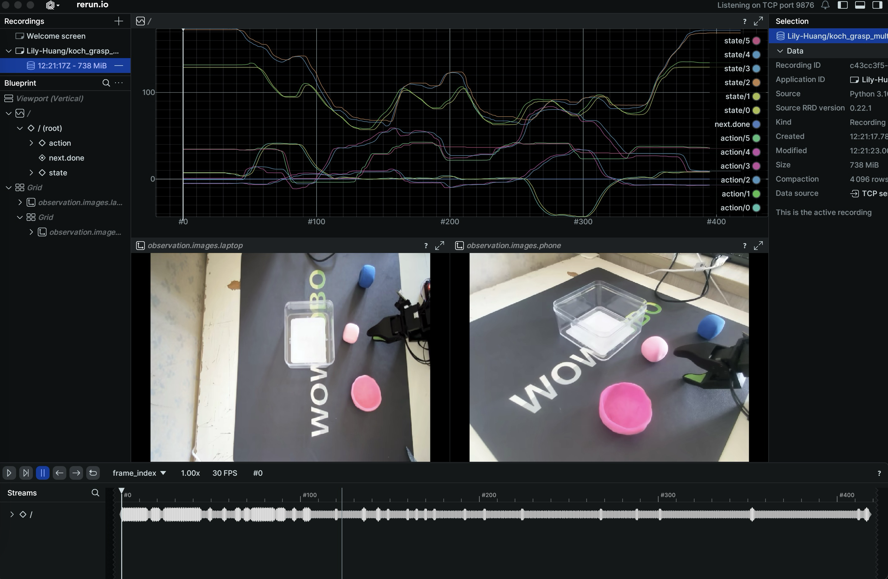
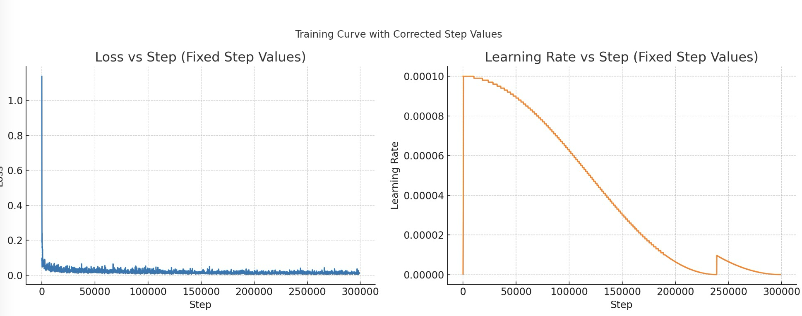

## Diffusion Policy多目标任务抓取训练

**任务描述**：本任务旨在利用具身智能系统(基于koch机器人)完成多目标抓取任务，探索Diffusion Policy的训练要点，增加场景理解，提高模型的泛化能力。

## 数据采集-多目标抓取

1. 机械臂采用ACT训练的机械臂，标定、测试等见ACT模型训练；

2. 数据采集，准备3个物品：橡皮泥红色小碗bowl、蓝色cube、粉色cube，当放置物品的盒子距离远的时候，需要模型能够理解，并夹取盒子放近点，再抓取。

3. 数据采集要求：

   采集之前需要先调节摄像头角度，确保顶部视角和侧视角可以清晰全面的看清楚从动机械臂的完整动作，在整个操作过程中，主动臂和操作员不能进入视野范围。

5. 录制训练数据

- 测试能否跑通遥操作

  ```bash
  python lerobot/scripts/control_robot.py teleoperate --robot-path lerobot/configs/robot/koch.yaml
  ```

- 采集数据集

  - 数据推送到huggingface，必须在当前环境中登录

  ```bash
  huggingface-cli login --token hf_token--add-to-git-credential
  HF_USER=$(huggingface-cli whoami | head -n 1)
  echo $HF_USER
  ```

  - 数据采集

  ```bash
  python lerobot/scripts/control_robot.py record \      # 运行control_robot.py中record子命令
      --robot-path lerobot/configs/robot/koch.yaml \
      --fps 30 \
      --root data \                                     # 本地文件夹
      --repo-id $HF_USER/koch_grasp_multiple_objects. \ # 文件夹下的目录，hugging face中也是这种目录
      --tags koch tutorial \
      --warmup-time-s 5 \                               # 预热时间，以防前几帧图片质量不好
      --episode-time-s 20  \                            # 一个episode的时间，s，遥操动作做完的时间；
      --reset-time-s 10  \                              # 把场景人为复原的时间
      --num-episodes 150  \                             # 采集的数据量
      --push-to-hub 1 \                                 # 是否上传到hugging face， 0-否，1-是
      --force-override 0                                # 采集数据是否覆盖之前的数据；
  ```
  
- **←（左方向键）**：当前采集失败，重新录制（**回到起始状态，不保存**）；**Enter（回车键）**：当前采集成功，保存为一个 Episode；**q** 或 **Ctrl+C**：中止录制进程或退出采集脚本

- 在采集过程中，num-episodes =150，分批采集即可；

6. 数据展示

   ```bash
   python lerobot/scripts/visualize_dataset.py \
       --root data \
       --repo-id Lily-Huang/koch_clip_clay_bowl \
       --episode-index 0
   ```
   
   

## DP训练和推理完整流程

1. DP模型的训练

```bash
python lerobot/scripts/train.py \
dataset_repo_id=/Users/huangli/code/xbot/lerobot/data/Lily-Huang/koch_grasp_multiple_objects20250429 env=koch_real \
policy=DP_koch_real \
hydra.run.dir=outputs/train/koch_grasp_multiple_objects \
hydra.job.name=dp_koch_test 	\
device=mps \ # MacOS系统芯片
wandb.enable=true
```

2. `DP_koch_rea.yaml`配置，第一次训练Unet部分使用的Resenet，效果不好，[第二次训练参考这个链接](https://github.com/box2ai-robotics/lerobot-joycon/tree/main)，Unet采用transformer。

- Diffusion Policy通常被认为比ALoha-ACT的模型更聪明更具有泛化性，但是调试难度更大，训练不容易收敛，需要更大的数据和更多的步数，我目前数据200集，其中[lerobot/configs/policy/diffusion.yaml](https://github.com/box2ai-robotics/lerobot-joycon/blob/main/lerobot/configs/policy/diffusion.yaml)中有几个建议修改的参数：
  - `n_action_steps`： 增大任务推理步长到100左右，可以汲取ACT的部分优势，更好训练一些
  - [crop_shape](https://github.com/box2ai-robotics/lerobot-joycon/blob/main/lerobot/configs/policy/diffusion.yaml:79)：增大随机裁剪尺寸，输入图像尺寸为480x640，建议修改为[440， 560]，保留更大的视野，可以更快的收敛一些，但泛化性会相对下降；
  - use_separate_rgb_encoder_per_camera: true  ，我有2个相机选择为每个相机使用单独的RGB编码器；

```yaml

seed: 100000  # 随机种子，确保实验可重复性
dataset_repo_id: Lily-Huang/koch_grasp_multiple_objects20250429  # 数据集ID，指定训练数据来源

# ========== 训练参数配置 ==========
training:
  # --- 训练步数和检查点 ---
  offline_steps: 300000  # 离线训练总步数，DP论文建议200k-300k，我训练到300k时，效果较好，理想时360k
  online_steps: 0        # 在线训练步数，设为0表示不进行在线训练
  eval_freq: -1          # 每训练20000步评估一次模型性能，官网中pusht、aloha都有响应的ygm，自己采集的数据没有响应的ygm，填-1，训练时候不进行评估
  log_freq : 100         # 训练日志输出频率
  save_freq: 20000       # 每训练20000步保存一次模型检查点
  save_checkpoint: true  # 是否保存检查点

  # --- 数据加载和批处理 ---
  num_workers: 8         # 数据加载的并行工作线程数，取决于CPU核心数，对GPU利用率影响较大需要找打合适的值
  batch_size: 32         # 每批训练的样本数，影响内存使用和训练稳定性

  # --- 优化器参数 ---
  grad_clip_norm: 10     # 梯度裁剪阈值，防止梯度爆炸
  lr: 1.0e-4             # 学习率，控制参数更新幅度
  lr_scheduler: cosine   # 学习率调度器类型，余弦退火可提高收敛性能
  lr_warmup_steps: 500   # 预热步数，初始阶段缓慢增加学习率
  adam_betas: [0.95, 0.999]  # Adam优化器的动量参数
  adam_eps: 1.0e-8           # Adam优化器的数值稳定性参数
  adam_weight_decay: 1.0e-6  # 权重衰减系数，控制正则化强度
  online_steps_between_rollouts: 1  # 在线训练中每次rollout之间的训练步数

  # --- 时间序列采样配置 ---
  # delta_timestamps定义了相对于当前时刻的时间点，用于采样观察和动作数据
  delta_timestamps:
    # 对于laptop相机，采样从(1-n_obs_steps)到1的时间点
    # 例如：n_obs_steps=2时，range(-1,1)=[-1,0]，即当前帧和前一帧
    observation.images.laptop: "[i / ${fps} for i in range(1 - ${policy.n_obs_steps}, 1)]"
    observation.images.phone: "[i / ${fps} for i in range(1 - ${policy.n_obs_steps}, 1)]"
    observation.state: "[i / ${fps} for i in range(1 - ${policy.n_obs_steps}, 1)]"
    # 对于动作，采样从(1-n_obs_steps)到(1-n_obs_steps+horizon)的时间点
    # 例如：n_obs_steps=2,horizon=16时，range(-1,15)=[-1,0,1,...,14]
    # 这包括历史动作和未来需预测的动作
    action: "[i / ${fps} for i in range(1 - ${policy.n_obs_steps}, 1 - ${policy.n_obs_steps} + ${policy.horizon})]"

  drop_n_last_frames: 7  

eval:
  n_episodes: 50
  batch_size: 50

policy:
  name: diffusion

  # Input / output structure.
  n_obs_steps: 2         # 观察历史帧数，用于理解环境动态
  horizon: 128           # 总的规划步数，
  n_action_steps: 100    # 实际执行的动作步数，通常小于horizon

  # --- 输入输出形状定义 ---
  input_shapes:
    # 图像输入形状：[通道数, 高度, 宽度]
    observation.images.laptop: [3, 480, 640]  # RGB图像
    observation.images.phone: [3, 480, 640]   # RGB图像
    observation.state: ["${env.state_dim}"]   # 状态向量维度，从环境配置中获取
  output_shapes:
    action: ["${env.action_dim}"]             # 动作向量维度，从环境配置中获取

  # --- 归一化配置 ---
  input_normalization_modes:
    # mean_std: 使用均值和标准差进行标准化
    observation.images.laptop: mean_std
    observation.images.phone: mean_std
    observation.state: min_max
  output_normalization_modes:
    action: min_max  
  

  # ===== 视觉骨干网络配置 =====
  vision_backbone: resnet18          # 视觉特征提取器类型
  crop_shape: [440,560]              # 图像裁剪大小，提高特征聚焦，我采集的图片不适合过度裁剪
  crop_is_random: false              # 随机裁剪用于数据增强，中心裁剪
  pretrained_backbone_weights: null  # 不使用ImageNet预训练权重
  use_group_norm: True               # 使用组归一化而非批归一化，对小批量更稳定，如果使用预训练权重则为false
  spatial_softmax_num_keypoints: 32  # 空间Softmax提取的关键点数量
  use_separate_rgb_encoder_per_camera: true  # 是否为每个相机使用单独的RGB编码器

  # ===== U-Net扩散模型配置 =====
  down_dims: [512, 1024, 2048]       # U-Net下采样路径每层通道数
  kernel_size: 5                     # 卷积核大小
  n_groups: 8                        # 组归一化的组数
  diffusion_step_embed_dim: 128      # 扩散步骤嵌入维度
  use_film_scale_modulation: True    # 使用FiLM条件调制

  # Transformer                      #增加Unet transformer的部分
  use_transformer: false
  n_layers: 4
  n_heads: 8
  n_embed: 512
  causal_attn: false

  # ===== 噪声调度器配置 =====
  noise_scheduler_type: DDPM         # 扩散过程类型：DDPM(训练)或DDIM(推理)，推理的时候配置文件改为DDIM
  num_train_timesteps: 100           # 训练中的扩散步数
  beta_schedule: squaredcos_cap_v2   # β调度策略，控制噪声添加方式
  beta_start: 0.0001                 # β起始值
  beta_end: 0.02                     # β结束值
  prediction_type: epsilon           # 预测模式：预测噪声而非样本
  clip_sample: True                  # 是否裁剪生成的样本
  clip_sample_range: 1.0             # 样本裁剪范围


  # Inference
  num_inference_steps: null  # if not provided, defaults to `num_train_timesteps`

  # Loss computation
  do_mask_loss_for_padding: false

```

2. 训练过程的指标变化

- 训练了280k steps，loss最终在0.003-0.015之间收敛



## DP模型推理过程

1. 读取模型的最后一个checkpoints进行实时推理

- 推理过程中需要把`"noise_scheduler_type": "DDIM"`，在`last/pretrained_model/config.json`和`config.yaml`都要改

```bash
python lerobot/scripts/control_robot_llm.py inference \
--robot-path lerobot/configs/robot/koch.yaml  \ 
--fps 30  \ 
--root data  \ 
--repo-id Lily-Huang/koch_grasp_multiple_objects20250429 \
--device mps \
-p outputs/train/act_koch_real/checkpoints/last/pretrained_model 

python lerobot/scripts/control_robot_llm.py inference --robot-path lerobot/configs/robot/koch.yaml --fps 30 --root data --repo-id Lily-Huang/koch_grasp_multiple_objects20250429 -p outputs/train/koch_grasp_multiple_objects/checkpoints/200000/pretrained_model
```

📺 **项目结果演示视频**

<table>
  <tr>
    <td style="text-align: center;">
      <strong>DP-multi-objects: 和 ACT 比较，可以捕捉 “如果需要把盒子夹近一些” 这个动作</strong><br>
      
    </td>
  </tr>
</table>

2. 定性的性能分析

- Diffusion Policy训练过程中建议DP的Unet部分采用Transformer，参数少，性能较好；
  - Unet Resnet：278M（total parameters）
  - Unet Transformer：41M （total parameters）
- Unet部分采用Resnet训练到300k steps，效果很差，基本抓取不了，后续查看发现：action和state训练时候的归一化和犯规一化写错了，写了mean_std，源代码是min_max，这是比较可能的原因。
- Unet Transformer训练到从260k进行推理，发现300k steps的时候，效果开始变得较好，基本准确率80%以上，训练到360k较理想
- 较ACT的训练结果可以发现，DP可以捕捉**放置物品的盒子距离远的时候，夹取盒子放近点，再抓取**。

## Diffusion Policy (扩散模型) 整数据处理流程

1. 在Diffusion建模的时候，会在机械臂可执行动作空间内随机初始化很多不同的控制噪声，形成不同的策略。经过多次“去噪”以后，筛选出最优的策略，这就是扩散控制模型的基本原理，这个过程是有非常严格的公式证明的。
2. Diffusion Policy是一种基于扩散模型的视觉运动策略，源自论文"Diffusion Policy: Visuomotor Policy Learning via Action Diffusion"。它利用扩散模型的生成能力来预测机器人的动作序列。

### DP训练过程

训练阶段数据流程：

```
1. DiffusionPolicy.forward(batch)
   ├─ 归一化输入: batch = self.normalize_inputs(batch)
   ├─ 堆叠多相机图像: batch["observation.images"] = torch.stack([...], dim=-4)
   ├─ 归一化目标: batch = self.normalize_targets(batch)
   └─ 2. DiffusionModel.compute_loss(batch)
       ├─ 输入验证和形状检查
       ├─ 3. DiffusionModel._prepare_global_conditioning(batch)
       │   ├─ 4. 形状变换: 不同相机是否共享resnet18特征提取器
       │   │   ├─ 单独编码器: "b s n ... -> n (b s) ..."
       │   │   └─ 共享编码器: "b s n ... -> (b s n) ..."
       │   ├─ 5. DiffusionRgbEncoder.forward(变换后的图像)
       │   │   ├─ 可选裁剪
       │   │   ├─ ResNet骨干网络提取特征
       │   │   ├─ 空间软最大池化
       │   │   └─ 线性投影
       │   ├─ 重新整形图像特征
       │   └─ 拼接并扁平化所有特征，
       ├─ 添加噪声到目标动作
       ├─ 6. UNet推理预测噪声或动作
       └─ 计算损失
```

1. 核心配置参数解释：

   ```python
   # 输入/输出结构
   n_obs_steps: int = 2                   # 观察历史步数
   horizon: int = 16                      # 预测动作的总长度
   n_action_steps: int = 8                # 实际执行的动作步数
   
   # 模型架构相关
   vision_backbone: str = "resnet18"      # 视觉骨干网络
   crop_shape: tuple[int, int] = (84, 84) # 图像裁剪尺寸
   spatial_softmax_num_keypoints: int = 32 # 空间软最大关键点数量
   
   # 扩散过程相关
   num_train_timesteps: int = 100         # 训练扩散时间步数
   beta_schedule: str = "squaredcos_cap_v2" # 噪声调度策略
   prediction_type: str = "epsilon"       # 预测类型(噪声或样本)
   ```

2. 数据结构和输入输出格式

- 在`forward/compute_loss`函数中（训练阶段），batch包含了时间序列的观察和动作数据：

  ```python
  # 训练阶段的batch结构
  batch = {
     "observation.images.laptop": [B, n_obs_steps, C, H, W],
     "observation.images.phone": [B, n_obs_steps, C, H, W],
     "observation.state": [B, n_obs_steps, state_dim],
     "action": [B, horizon, action_dim],            # 目标动作序列
     "action_is_pad": [B, horizon]                  # 填充标识
  }
  ```

- 在`select_action`函数中（推理/执行阶段），batch包含的是单个时间步的观察数据：

  ```python
  # 推理/执行阶段的batch结构
  batch = {
     "observation.images.laptop": [B, C, H, W],     # 顶部相机图像
     "observation.images.phone": [B, C, H, W],      # 侧视相机图像
     "observation.state": [B, state_dim],           # 机器人状态（关节角度等）
     # 可选的环境状态（如果使用）
     "observation.environment_state": [B, env_state_dim]
  }
  ```

3. Diffusion Policy的完整数据处理流程如下：

- 1）训练数据结构和预处理

  ```python
  # 训练批次数据结构
  batch = {
      "observation.images.laptop": [B, n_obs_steps, C, H, W],  # 第一个相机视角
      "observation.images.phone": [B, n_obs_steps, C, H, W],   # 第二个相机视角
      "observation.state": [B, n_obs_steps, state_dim],        # 机器人状态
      "action": [B, horizon, action_dim],                      # 目标动作序列
      "action_is_pad": [B, horizon]                            # 动作填充标识
  }
  
  # 1. DiffusionPolicy.forward方法处理流程，⚠️注意：有两个forward，参照上面的训练结构图
  def forward(self, batch):
      # 归一化输入（值域变换，维度不变）
      batch = self.normalize_inputs(batch)
  
      # 堆叠多相机图像
      batch["observation.images"] = torch.stack([batch[k] for k in self.expected_image_keys], dim=-4)
      # 结果: [B, n_obs_steps, num_cameras, C, H, W]
  
      # 归一化目标动作
      batch = self.normalize_targets(batch)
  
      # 计算损失
      loss = self.diffusion.compute_loss(batch)
      return {"loss": loss}
  ```

- 2）全局条件准备与视觉特征提取

  ```python
  # DiffusionModel.compute_loss中调用_prepare_global_conditioning
  def _prepare_global_conditioning(self, batch):
      batch_size, n_obs_steps = batch["observation.state"].shape[:2]
      global_cond_feats = [batch["observation.state"]]  # [B, n_obs_steps, state_dim]
  
      # 处理图像特征
      if self._use_images:
          if self.config.use_separate_rgb_encoder_per_camera:
              # 重排图像张量，相机维度放前面，每个相机不同的网络
              # [B, n_obs_steps, num_cameras, C, H, W] -> [num_cameras, (B*n_obs_steps), C, H, W]
              images_per_camera = einops.rearrange(batch["observation.images"], "b s n ... -> n (b s) ...")
  
              # 每个相机使用独立编码器
              # self.rgb_encoder即为：DiffusionRgbEncoder.forward
              img_features_list = torch.cat([
                  encoder(images) 
                  for encoder, images in zip(self.rgb_encoder, images_per_camera)
              ])
              # 结果: [(B*n_obs_steps), (num_cameras*feature_dim)]
  
              # 重新整形回批次和时间维度
              # [(B*n_obs_steps), feature_dim] -> [B, n_obs_steps, (num_cameras*feature_dim)]
              img_features = einops.rearrange(
                  img_features_list, "(n b s) ... -> b s (n ...)", b=batch_size, s=n_obs_steps
              )
          else:
              # 使用共享编码器，合并批次、时间和相机维度，所有相机同一个网络
              # [B, n_obs_steps, num_cameras, C, H, W] -> [(B*n_obs_steps*num_cameras), C, H, W]
              images = einops.rearrange(batch["observation.images"], "b s n ... -> (b s n) ...")
  
              # 图像编码
              img_features = self.rgb_encoder(images)  # [(B*n_obs_steps*num_cameras), feature_dim]
  
              # 重新整形
              img_features = einops.rearrange(
                  img_features, "(b s n) ... -> b s (n ...)", b=batch_size, s=n_obs_steps
              )
              # 结果: [B, n_obs_steps, (num_cameras*feature_dim)]
  
          # 添加到特征列表
          global_cond_feats.append(img_features)
  
      # 添加环境状态（如果有）
      if self._use_env_state:
          global_cond_feats.append(batch["observation.environment_state"])
  
      # 拼接特征并展平
      # [B, n_obs_steps, combined_feature_dim] -> [B, (n_obs_steps*combined_feature_dim)]
      # combined_feature_dim = num_cameras*feature_dim + state_dim
      return torch.cat(global_cond_feats, dim=-1).flatten(start_dim=1)
  ```

- 3）图像编码器详解，是在 `_prepare_global_conditioning`调用`self.rgb_encoder`

  ```python
  # DiffusionRgbEncoder.forward方法
  def forward(self, x):
      """
      输入: x: [B, C, H, W] 图像张量
      输出: [B, feature_dim] 特征向量
      """
      # 可选的裁剪预处理
      if self.do_crop:
          if self.training:
              x = self.maybe_random_crop(x)  # 训练时随机裁剪
          else:
              x = self.center_crop(x)        # 推理时中心裁剪
  
      # ResNet提取特征
      backbone_features = self.backbone(x)  # [B, 512, h', w']
  
      # 空间软最大池化提取关键点
      # 输入: [B, 512, h', w']
      # 输出: [B, num_keypoints, 2]
      pooled_features = self.pool(backbone_features)
  
      # 展平并投影
      x = torch.flatten(pooled_features, start_dim=1)  # [B, num_keypoints*2]
      x = self.relu(self.out(x))  # [B, feature_dim]
  
      return x
  ```

- 4）扩散模型损失计算，在 `DiffusionPolicy.forward`调用的loss函数

  ```python
  def compute_loss(self, batch):
      """计算扩散模型训练损失"""
      # 输入数据验证
      assert set(batch).issuperset({"observation.state", "action", "action_is_pad"})
      n_obs_steps = batch["observation.state"].shape[1]
      horizon = batch["action"].shape[1]
      assert horizon == self.config.horizon
      assert n_obs_steps == self.config.n_obs_steps
  
      # 准备全局条件，经过图像特征提取后，且和state结合的特征
      global_cond = self._prepare_global_conditioning(batch)  # [B, global_cond_dim]
  
      # 获取目标动作轨迹
      trajectory = batch["action"]  # [B, horizon, action_dim]
  
      # 随机采样噪声
      eps = torch.randn(trajectory.shape, device=trajectory.device)
  
      # 随机采样噪声时间步
      # 理论上是一步步加噪声，但实际训练时，直接根据随机采样的时间步 t，一次性加对应t时刻的总噪声量。
      # 噪声强度随着 t 增大而增大。
      timesteps = torch.randint(
          low=0,
          high=self.noise_scheduler.config.num_train_timesteps,
          size=(trajectory.shape[0],),
          device=trajectory.device,
      ).long()
  
      # 前向扩散：向干净轨迹添加噪声，这个就对应DDPM论文中公式：x_t = √(αₜ) x₀ + √(1-αₜ) ε
      noisy_trajectory = self.noise_scheduler.add_noise(trajectory, eps, timesteps)
  
      # UNet预测（噪声或原始轨迹）
      pred = self.unet(noisy_trajectory, timesteps, global_cond=global_cond)
  
      # 根据预测类型选择目标
      if self.config.prediction_type == "epsilon": # 此时UNet输出为噪声预测
          target = eps  # 预测噪声
      elif self.config.prediction_type == "sample": # 此时UNet输出为轨迹预测
          target = batch["action"]  # 预测原始轨迹，Lerobot
  
      # 计算损失
      loss = F.mse_loss(pred, target, reduction="none")
  
      # 可选：掩码填充部分的损失
      if self.config.do_mask_loss_for_padding:
          in_episode_bound = ~batch["action_is_pad"]
          loss = loss * in_episode_bound.unsqueeze(-1)
  
      return loss.mean()
  ```

- 5）条件UNet结构和前向传播，`compute_loss`中的`self.unet`

  ```python
  class DiffusionConditionalUnet1d(nn.Module):
      def forward(self, x, timestep, global_cond=None):
          """
          输入:
            x: [B, horizon, action_dim] 带噪声的动作序列
            timestep: [B] 当前扩散时间步，每个样本可以随机对应自己独立的时间步xt，每个batch中的样本有自己的t
            global_cond: [B, global_cond_dim] 全局条件向量
          输出:
            [B, horizon, action_dim] 预测结果
          """
          # 调整形状适应1D卷积
          x = einops.rearrange(x, "b t d -> b d t")  # [B, action_dim, horizon]
  
          # 时间步编码
          timesteps_embed = self.diffusion_step_encoder(timestep)  # [B, embed_dim]
  
          # 拼接时间步编码和全局条件
          if global_cond is not None:
              # global_feature.shap = [B, (n_cameras * feature_dim + state_dim + embed_dim)]
              global_feature = torch.cat([timesteps_embed, global_cond], axis=-1)
          else:
              global_feature = timesteps_embed
  
          # UNet编码器部分3个encoder，网络输入是噪声的动作序列
          # global_feature是 FiLM 作用在 ResNet block 的特征输出上，做的是通道方向的线性缩放和平移（逐通道调制）。
          # global_feature通过一个MLP为每个通道生成一堆系数，然后加载resnet的输出结果上
          #   cond_embed = self.cond_encoder(cond).unsqueeze(-1)  # cond是global_feature
          #   if self.use_film_scale_modulation:
                # 将嵌入分为缩放和偏置参数
          #      scale = cond_embed[:, : self.out_channels]
          #      bias = cond_embed[:, self.out_channels :]
          #      out = scale * out + bias  # 同时应用缩放和偏置
          #   else:
          # 只应用偏置
          #      out = out + cond_embed
          encoder_skip_features = []
          for resnet, resnet2, downsample in self.down_modules:
              x = resnet(x, global_feature)
              x = resnet2(x, global_feature)
              encoder_skip_features.append(x)
              x = downsample(x)  # 下采样
  
          # UNet中间部分
          # UNet的中间部分（self.mid_modules）确实是使用FiLM条件调制的DiffusionConditionalResidualBlock1d模块
          # UNet的中间部分是由两个带有FiLM条件调制的残差块组成，这些残差块允许全局条件（图像特征、状态和时间步信息）影响特征映射处理。这是使条件扩散模型能够根据输入观察生成相应动作序列的关键机制之一。
          for mid_module in self.mid_modules:
              x = mid_module(x, global_feature)
  
          # UNet解码器部分（带跳跃连接）2个decoder
          for resnet, resnet2, upsample in self.up_modules:
              x = torch.cat((x, encoder_skip_features.pop()), dim=1)  # 添加跳跃连接
              x = resnet(x, global_feature)
              x = resnet2(x, global_feature)
              x = upsample(x)  # 上采样
  
          x = self.final_conv(x)  # [B, action_dim, horizon]
  
          # 恢复原始形状
          x = einops.rearrange(x, "b d t -> b t d")  # [B, horizon, action_dim]
  
          return x
  ```

### DP推理过程

1. 推理过程的整体流程

   ```text
   1. DiffusionPolicy.select_action(batch)
      ├─ 归一化输入: batch = self.normalize_inputs(batch)
      ├─ 堆叠多相机图像: batch["observation.images"] = torch.stack([...], dim=-4)
      ├─ 更新观察队列: self._queues = populate_queues(self._queues, batch)
      └─ 如果动作队列为空:
          ├─ 从队列堆叠观察: batch = {k: torch.stack(list(self._queues[k]), dim=1) for k...}
          ├─ 2. DiffusionModel.generate_actions(batch)
          │   ├─ 3. DiffusionModel._prepare_global_conditioning(batch)
          │   │   ├─ 4. 形状变换:
          │   │   │   ├─ 单独编码器: "b s n ... -> n (b s) ..."
          │   │   │   └─ 共享编码器: "b s n ... -> (b s n) ..."
          │   │   ├─ 5. DiffusionRgbEncoder.forward(变换后的图像)
          │   │   │   ├─ 可选裁剪(评估时使用中心裁剪)
          │   │   │   ├─ ResNet骨干网络提取特征
          │   │   │   ├─ 空间软最大池化
          │   │   │   └─ 线性投影
          │   │   ├─ 重新整形图像特征
          │   │   └─ 拼接并扁平化所有特征 
          │   ├─ 6. DiffusionModel.conditional_sample(global_cond)
          │   │   ├─ 生成初始噪声
          │   │   ├─ 设置扩散时间步
          │   │   ├─ 循环去噪过程:
          │   │   │   ├─ UNet预测
          │   │   │   └─ 噪声调度器步进
          │   │   └─ 返回去噪后的动作序列
          │   └─ 提取所需部分的动作
          ├─ 反归一化动作
          └─ 将动作添加到队列
      └─ 从队列返回下一个动作
   ```

1. 单步观察输入处理

   ```python
   # 推理阶段的输入
   batch = {
     "observation.images.laptop": [B, C, H, W],  # 笔记本相机图像（单时间步）
     "observation.images.phone": [B, C, H, W],   # 手机相机图像（单时间步）
     "observation.state": [B, state_dim],        # 机器人状态（单时间步）
   }
   ```

2. 观察队列管理

   ```python
   @torch.no_grad
   def select_action(self, batch):
       # 归一化输入
       batch = self.normalize_inputs(batch)
   
       # 堆叠多相机图像
       batch["observation.images"] = torch.stack([batch[k] for k in self.expected_image_keys], dim=-4)
       # 结果: [B, num_cameras, C, H, W]
   
       # 更新观察队列
       self._queues = populate_queues(self._queues, batch)
       # 队列结构：
       # self._queues = {
       #     "observation.state": deque(maxlen=n_obs_steps),       # 最近n_obs_steps步的状态
       #     "observation.images": deque(maxlen=n_obs_steps),      # 最近n_obs_steps步的图像
       #     "action": deque(maxlen=n_action_steps),               # 预测的动作序列
       # }
   
       # 如果动作队列为空，生成新的动作序列
       if len(self._queues["action"]) == 0:
           # 从队列构建序列输入，将队列中存储的历史观察数据（状态和图像）转换为模型需要的格式
           batch = {k: torch.stack(list(self._queues[k]), dim=1) for k in batch if k in self._queues}
           # 结果: 
           # "observation.state": [B, n_obs_steps, state_dim]
           # "observation.images": [B, n_obs_steps, num_cameras, C, H, W]
   
           # 生成动作序列
           actions = self.diffusion.generate_actions(batch)  # [B, n_action_steps, action_dim]
   
           # 反归一化
           actions = self.unnormalize_outputs({"action": actions})["action"]
   
           # 将动作添加到队列
           self._queues["action"].extend(actions.transpose(0, 1))
           # 转置后: n_action_steps个[B, action_dim]
   
       # 返回下一个动作
       action = self._queues["action"].popleft()  # [B, action_dim]
       return action
   ```

3. 动作生成详解，`select_action`中的`self.diffusion.generate_actions`

   ```python
   def generate_actions(self, batch):
       batch_size, n_obs_steps = batch["observation.state"].shape[:2]
       assert n_obs_steps == self.config.n_obs_steps
   
       # 准备全局条件，此时推理的输入数据已经经过reset18进行特征提取，并且和state进行concat
       global_cond = self._prepare_global_conditioning(batch)  # [B, global_cond_dim]
   
       # 条件扩散采样
       actions = self.conditional_sample(batch_size, global_cond=global_cond)
       # 结果: [B, horizon, action_dim]
   
       # 提取需要的动作部分
       start = n_obs_steps - 1  # 从当前观察对应的位置开始
       end = start + self.config.n_action_steps
       actions = actions[:, start:end]  # [B, n_action_steps, action_dim]
   
       return actions
   ```

4. 条件扩散采样过程，`generate_actions`中的`self.conditional_sample`

   ```python
   # 推理的过程中是初始化一个噪音动作，和输入的图像和state数据形成的global_cond然后输入到Unet网络
   # 输出的model_output是通过训练好的unet输出的噪声
   def conditional_sample(self, batch_size, global_cond=None):
       device = get_device_from_parameters(self)
       dtype = get_dtype_from_parameters(self)
   
       # 采样初始噪声，随机噪音
       sample = torch.randn(
           size=(batch_size, self.config.horizon, self.config.output_shapes["action"][0]),
           dtype=dtype, device=device
       )  # [B, horizon, action_dim]
   
       # 设置扩散时间步
       self.noise_scheduler.set_timesteps(self.num_inference_steps)
   
       # 逐步去噪
       for t in self.noise_scheduler.timesteps:
           # 预测模型输出，self.config.prediction_type == "epsilon"，输出的是噪音，
           model_output = self.unet(
               sample,
               torch.full(sample.shape[:1], t, dtype=torch.long, device=sample.device),
               global_cond=global_cond
           )
   
           # 噪声调度器步进，通过输出的噪音以及sample带噪音的动作，来输出去除噪音的动作sample
           # sample去除预测出的model_output噪声，得到更好的带噪声动作
           # x_{t-1} = 1/√α_t * (x_t - (1-α_t)/√(1-ᾱ_t) * ε_θ(x_t, t)) + σ_t * z
           # sample就是这个公式中的x_{t-1}，ε_θ是model_output，x_t是上一步的sample
           sample = self.noise_scheduler.step(model_output, t, sample).prev_sample
   
       return sample  # [B, horizon, action_dim]
   ```

### 其余模块

1. 队列机制细节说明

   ```python
   def populate_queues(queues, batch):
        for key in batch:
            # 忽略不在队列中的键
            if key not in queues:
                continue
            if len(queues[key]) != queues[key].maxlen:
                # 初始化：复制第一个观察填充队列
                while len(queues[key]) != queues[key].maxlen:
                    queues[key].append(batch[key])
            else:
                # 添加最新观察（自动移除最老的）
                queues[key].append(batch[key])
        return queues
   ```

   ```
   观察队列 (n_obs_steps=2)：
   [观察t-1] → [观察t]
                 ↓
   预测动作 (horizon=16)：
   [动作t, 动作t+1, ..., 动作t+15]
                 ↓
   执行动作 (n_action_steps=8)：
   [动作t, 动作t+1, ..., 动作t+7]
   ```

2. FiLM条件调制机制

   ```python
   class DiffusionConditionalResidualBlock1d(nn.Module):
      def forward(self, x, cond):
          """
          输入:
            x: [B, in_channels, T] 特征图
            cond: [B, cond_dim] 条件向量
          输出:
            [B, out_channels, T] 条件调制后的特征
          """
          # 卷积处理
          h = self.conv1(x)  # [B, out_channels, T]
   
          # FiLM条件调制参数
          film = self.cond_encoder(cond)  # [B, out_channels] 或 [B, out_channels*2]
   
          if self.use_film_scale_modulation:
              # 缩放和偏置调制
              scale, bias = torch.chunk(film, 2, dim=1)
              h = h * (scale.unsqueeze(-1) + 1) + bias.unsqueeze(-1)
          else:
              # 仅偏置调制
              h = h + film.unsqueeze(-1)
   
          # 第二次卷积
          h = self.conv2(h)
   
          # 残差连接
          return h + self.residual_conv(x)
   ```

3. UNet

- U-Net是扩散模型的核心组件，负责学习从噪声轨迹中恢复原始轨迹

- 采用1D卷积处理时序动作数据，与传统图像处理中的2D U-Net类似

- 使用双路径结构：下采样路径压缩特征，上采样路径还原维度

- 使用跳跃连接保留下采样过程中的细节信息

4. FiLM

- 通过FiLM（特征线性调制）机制将全局条件融入每个卷积块

  - **FiLM 不是“直接拼接”，而是“通过条件来控制网络每一层的激活分布”**，它不是把条件信息加入到输入中（像 concat 那样），而是**控制输入的特征分布**。

  ```python
  scale, shift = MLP(condition).chunk(2, dim=-1)
  x = conv(x)
  x = scale.unsqueeze(-1) * x + shift.unsqueeze(-1)
  ```

  - 正确认知：FiLM vs BatchNorm 对比

    | 属性           | **BatchNorm**                        | **FiLM**                             |
    | -------------- | ------------------------------------ | ------------------------------------ |
    | γ / β 来源     | ✅ 可学习参数，**固定**（和输入无关） | ✅ 动态生成，**来自条件输入（cond）** |
    | 是否随输入变化 | ❌ 不变化（γ/β 是 learnable 的常量）  | ✅ 会变（γ/β 是 `MLP(cond)` 的输出）  |
    | 控制作用       | 全局标准化 → 更快训练                | 条件调控 → 多任务、多模态适应        |
    | 使用位置       | 标准层后（Conv、Linear）             | 残差模块中或注意力后做调制           |

  ```python
  # BatchNorm（固定 γ/β）：
  bn = nn.BatchNorm1d(256)
  x = bn(x)  # γ 和 β 是模型参数，但在每个样本上是固定的
  
  # FiLM（动态 γ/β）
  film = nn.Linear(cond_dim, 2 * 256)
  scale, shift = film(cond).chunk(2, dim=-1)
  x = scale.unsqueeze(-1) * x + shift.unsqueeze(-1)  # 每个样本不同
  ```

5. 推理时的采样过程，**训练和推理在 Diffusion 模型中本来就是不同机制：**

- 推理必须「逐步地还原噪声 → 数据」

- 训练只需要「从任意 xt学习 denoise 一次」即可，**不需要完整跑 T 步**

- 推理阶段 = 条件生成 + 多步去噪采样

- 对应的是DDPM中的sample公式

- Step 1准备输入

   1.1 随机动作初始化：从高斯分布采样

  ```python
  x_t = torch.randn([B, T, D])  # 初始纯噪声动作
  ```

  1.2 提取条件信息（图像 + 状态）

  ```python
  # 图像序列可能有多帧，每帧提特征
  image_feats = image_encoder(images)     # [B, feat_dim]
  state_feats = state_encoder(states)     # [B, state_dim]
  
  # 拼接成全局条件向量
  global_cond = torch.cat([image_feats, state_feats], dim=-1)  # [B, G]
  ```

- Step 2：多步反向去噪采样，从 `t = T` 逐步到 `t = 0`，每一步都用同一个 UNet：这个 `scheduler.step(...)` 就是实现论文中经典的反向公式（根据 DDPM、DDIM 等）

  ```python
  for t in reversed(range(T)):  # e.g. T = 1000
      t_tensor = torch.full([B], t, dtype=torch.long)
      
      # 预测当前 x_t 的噪声分量
      eps_hat = unet(x_t, t_tensor, global_cond)
      
      # 执行一轮反向采样：x_t → x_{t-1}
      x_t = scheduler.step(eps_hat, t, x_t).prev_sample
  
  ```

- Step 3：最终输出干净动作

  ```python
  x_0 = x_t  # 最后一轮后的 x₀ 就是预测出来的动作序列
  ```
