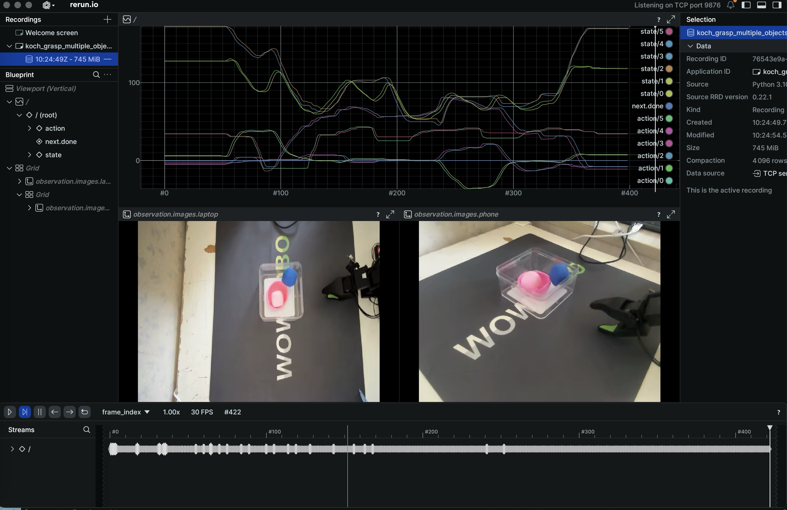
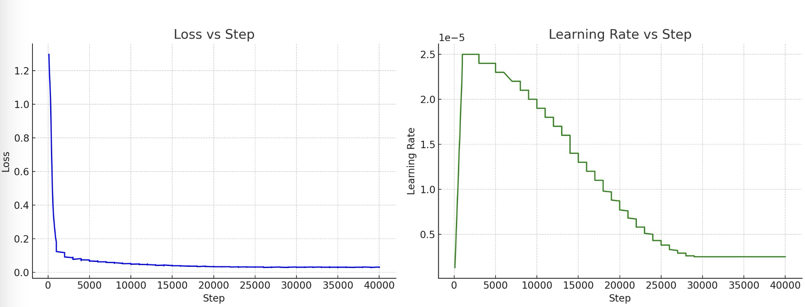
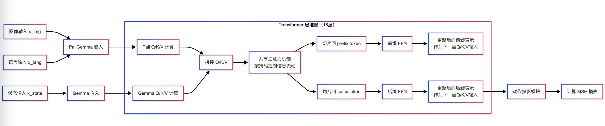
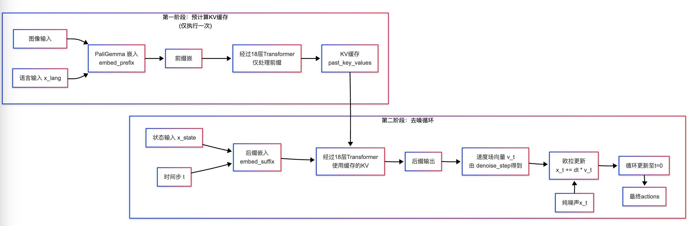

## 基础配置环境安装

1. 环境安装

   ```bash
   conda create -n pio python=3.10
   conda install -c conda-forge ffmpeg
   pip install -e ".[pi0]"
   
   conda install -c conda-forge transformers
   conda install -c conda-forge pytest 
   pip install -e .
   
   pip install -e".[dynamixel]"
   pip install poetry
   poetry install --sync --extras "dynamixel"
   ```


## Pi0数据格式介绍

1. Pi0模型在lerobot的V2版本支持的模型，所以需要在其V2版本代码下进行操作;

2. 把训练DP模型采集的抓取多任务的V1版本数据集转换为V2版本

   ```bash
   # 我使用的版本convert_dataset_v1_to_v2.py是针对hugging face数据，所以cursor写了一个local数据集的转换
   python convert_local_dataset_v1_to_v2.py  \    
   --input-dir /Users/huangli/code/lerobot/data/Lily-Huang/koch_grasp_multiple_objects20250429v1 \   
   --output-dir /Users/huangli/code/lerobot/data/Lily-Huang/koch_grasp_multiple_objects20250429v2 \
   --single-task "Put the objects on the table into the box. If the box is too far, move it closer first." \
   --robot-config koch
   ```


3. 转换为v2的数据集目录

   ```
   # 数据集200episodes，放在一个chunk，数据集多的话可以分为多个chunk
   .koch_grasp_multiple_objects20250429v2
   ├── data
   │   └── chunk-000
   │       ├── episode_000000.parquet
   │       ├── episode_000001.parquet
   │       ├── episode_000002.parquet
   │       ├── episode_000003.parquet
   │       ├── episode_000004.parquet
   │       └── ...
   ├── meta
   │   ├── episodes.jsonl
   │   ├── info.json
   │   ├── stats.json
   │   └── tasks.jsonl
   └── videos
       └── chunk-000
           ├── observation.images.laptop
           │   ├── episode_000000.mp4
           │   ├── episode_000001.mp4
           │   ├── episode_000002.mp4
           │   ├── episode_000003.mp4
           │   ├── episode_000004.mp4
           │   └── ...
           └── observation.images.phone
               ├── episode_000000.mp4
               ├── episode_000001.mp4
               ├── episode_000002.mp4
               ├── episode_000003.mp4
               ├── episode_000004.mp4
               └── ...
   ```

4. 数据集展示（DP训练的同一批数据）

   ```bash
   python lerobot/scripts/visualize_dataset.py \         
   --repo-id koch_grasp_multiple_objects \                                                            
   --root /Users/huangli/code/lerobot/data/Lily-Huang/koch_grasp_multiple_objects20250429v2 \      
   --episode-index 199 \
   --local-files-only 1 # 目前最新版本的lerobot这个参数去掉了，需要根据实际来运行代码
   ```

   

## Pi0训练流程和推理

1. Pi0模型训练

- 训练配置
  - Pi0模型的训练需要显存48G以上；
  - 我使用的是autodl的L0，98G显存，数据盘扩容到100GB，系统盘30GB

2. 训练流程

- 参数配置：`lerobot/configs/train.py`

```python
@dataclass
class TrainPipelineConfig(HubMixin):
    dataset: DatasetConfig
    env: envs.EnvConfig | None = None       # env主要用于模拟训练时的在线评估，离线训练，None
    policy: PreTrainedConfig | None = None  #  PreTrainedConfig类型，定义要训练的策略模型的配置参数(如PI0Config)
    output_dir: Path | None = None          # 输出目录路径，用于保存训练结果、检查点等文件
    job_name: str | None = None             # 设置任务的名称
    resume: bool = False                    # 当程序崩掉后，继续训练需要在命令中设置为true，首次训练false 
    device: str | None = None  # cuda | cpu | mps # mps是apple芯片
    use_amp: bool = False                   # 是否使用混合精度训练
    seed: int | None = 1000                 # 随机种子，默认1000
    num_workers: int = 8                    # 数据加载器使用的线程数。
    batch_size: int = 24
    steps: int = 60000                     # 设置训练的总步数，原文建议5k-30ksteps，batch设置小，多加些steps 
    eval_freq: int = 10000                  # 设置训练过程中评估的频率   
    log_freq: int = 100                     # 设置日志记录的频率
    save_checkpoint: bool = True
    # Checkpoint is saved every `save_freq` training iterations and after the last training step.
    save_freq: int = 20000                  # 设置检查点保存的频率，每20000steps保存一次   
    use_policy_training_preset: bool = True # 是否使用策略模型提供的默认优化器和学习率调度器设置，视觉编码冻结，只微调流匹配(flow matching)层和动作解码层
    optimizer: OptimizerConfig | None = None# 自定义优化器配置，如果为None并且use_policy_training_preset为True，则使用策略默认配置
    scheduler: LRSchedulerConfig | None = None # 自定义学习率调度器，如果为None并且use_policy_training_preset为True，则使用策略默认配置
    eval: EvalConfig = field(default_factory=EvalConfig)
    wandb: WandBConfig = field(default_factory=WandBConfig)
```

- 模型训练：

```bash
python lerobot/scripts/train.py \
--dataset.repo_id=Lily-Huang/koch_grasp_multiple_objects20250429v2 \
--dataset.root=/Users/huangli/code/lerobot_pi0/lerobot/data/Lily-Huang/koch_grasp_multiple_objects20250429v2 \
--policy.type=pi0 \
--output_dir=outputs/train/koch_grasp_multiple_objects \
--job_name=pi0_koch_tutorial \
--device=mps \
--wandb.enable=false

python lerobot/scripts/train.py --dataset.repo_id=Lily-Huang/koch_grasp_multiple_objects20250429v2 --dataset.root=/root/autodl-tmp/lerobot_pi0/lerobot/data/Lily-Huang/koch_grasp_multiple_objects20250429v2 --policy.type=pi0 --output_dir=outputs/train/koch_grasp_multiple_objects_pi0 --job_name=pi0_koch_tutorial --device=cuda --wandb.enable=false
```



- 模型推理

```bash
python lerobot/scripts/control_robot.py \
--robot.type=koch \
--control.type=record \
--control.root=data \
--control.fps=30 \
--control.single_task="Put the objects on the table into the box. If the box is too far, move it closer first." \
--control.repo_id=Lily-Huang/eval_koch_grasp_multiple_objects20250429v2 \
--control.num_episodes=10 \
--control.warmup_time_s=4 \
--control.episode_time_s=40 \
--control.reset_time_s=10 \
--control.push_to_hub=false \
--control.policy.path=/lerobot/outputs/train/koch_grasp_multiple_objects_pi0/checkpoints/010000
```

- 整个训练过程，到30k steps基本收敛了，但是模型的表现不是特别好，还需要继续调参；

## Pi0算法原理和整体流程

1. π0号称地表最强通用VLA大模型。模型可以应用至多个机器人平台，多种类型的机械臂。完成长时间多物体的桌面分类，多件衣服折叠，折纸盒这种任务复杂度高，多阶段的精细操作。而这是以前VLA模型几乎没法做到的(具体在实验部分中介绍)。
2. πo的核心设计理念在于通过多任务大规模数据训练，赋予机器人在各种复杂场景中展现广泛适应能力。它的数据来源于两方面，一方面是OXE数据集。还有自采数据集，来自于7个机器人和68个任务，这两个数据集的总时长超过10000小时，极大丰富了训练数据的多样性和物理交互场景。

4. 算法核心原理

- Pi0是一种基于流模型(Flow Matching)的视觉-语言-动作生成模型，用于通用机器人控制。与Diffusion Policy的扩散模型不同，Pi0使用流匹配(Flow Matching)原理进行轨迹生成。

- 核心技术特点：流匹配(Flow Matching)：不同于扩散模型的逐步去噪过程，流匹配直接学习从噪声空间到真实轨迹空间的连续变换流。

- 多模态融合架构：

  使用`PaliGemma`模型处理视觉和语言输入

  使用`Gemma Expert`模型生成机器人动作

  采用两阶段编码-解码架构

- 条件生成：基于图像、语言指令和机器人状态三种条件生成动作轨迹

5. 模型架构

- `PaliGemma`：处理视觉和语言输入的多模态编码器

  - 使用`SigLIP`作为视觉骨干网络，和`CLIP`网络结构类似，是一种更高效、轻量的 `CLIP `，`images`经过`SigLIP`生成`image tokens`。

  - 使用Gemma作为语言骨干网络，language tokens 经过Gemma LLM生成潜在的语言表达特征；

- Gemma Expert：动作解码器，负责生成机器人动作轨迹

  - 每个 Expert 本质是一个小型的 `decoder-only transformer`，使用 `Gemma` 架构，Gemma 2B模型。

  - 接收PaliGemma的key-value缓存，提供 context；
  - 接收机器人状态和噪声输入，相当于`Gemma`中的`query`

- 流匹配模块：实现从噪声到动作轨迹的连续变换

### Pi0训练流程

1. 训练阶段数据流程：

```
1. PI0Policy.forward(batch)
   ├─ 归一化输入: batch = self.normalize_inputs(batch)
   ├─ 准备图像: images, img_masks = self.prepare_images(batch)
   ├─ 准备状态: state = self.prepare_state(batch)
   ├─ 准备语言: lang_tokens, lang_masks = self.prepare_language(batch)
   ├─ 准备动作: actions = self.prepare_action(batch)
   └─ 2. PI0FlowMatching.forward(images, img_masks, lang_tokens, lang_masks, state, actions, noise, time)
       ├─ 样本噪声(如果未提供): noise = self.sample_noise(actions.shape, actions.device)
       ├─ 样本时间步(如果未提供): time = self.sample_time(actions.shape[0], actions.device)
       ├─ 构建噪声动作: x_t = time_expanded * noise + (1 - time_expanded) * actions
       ├─ 计算目标向量场: u_t = noise - actions
       ├─ 3. 嵌入前缀(视觉和语言): embed_prefix(images, img_masks, lang_tokens, lang_masks)
       │   ├─ SigLIP处理图像
       │   ├─ Gemma嵌入处理语言tokens
       │   └─ 组合图像和语言嵌入
       ├─ 4. 嵌入后缀(状态和噪声动作): embed_suffix(state, x_t, time)
       │   ├─ 机器人状态投影
       │   ├─ 时间步嵌入(正弦-余弦位置编码)
       │   ├─ 动作和时间融合
       │   └─ 创建注意力掩码
       ├─ 5. PaliGemmaWithExpert.forward(attention_mask, position_ids, inputs_embeds=[prefix_embs, suffix_embs])
       │   ├─ PaliGemma处理前缀(图像和语言)
       │   └─ Gemma Expert处理后缀(状态和噪声动作)
       ├─ 提取动作输出
       ├─ 预测向量场: v_t = self.action_out_proj(suffix_out)
       └─ 计算流匹配损失: losses = F.mse_loss(u_t, v_t, reduction="none")
```



2. 输入原始数据及其形状，数据输入需要统一到模型输入的格式要求

- 准备图像: `images, img_masks = self.prepare_images(batch)`

  | 机器人平台     | 原始输入                                                     | 统一后                                                       | 处理方式                                   |
  | -------------- | ------------------------------------------------------------ | ------------------------------------------------------------ | ------------------------------------------ |
  | 单相机机器人   | `"observation.images.main": [B, 3, 720, 1280]`               | `images = [[B, 3, 224, 224]]`                                | 调整大小并保持宽高比，用黑色填充           |
  | 双相机机器人   | `"observation.images.top": [B, 3, 480, 640]`  <br> `"observation.images.wrist": [B, 3, 640, 480]` | `images = [[B, 3, 224, 224], [B, 3, 224, 224]]`              | 各自调整大小并保持宽高比                   |
  | 三相机机器人   | `"observation.images.top": [B, 3, 480, 640]` <br> `"observation.images.left": [B, 3, 480, 640]` <br> `"observation.images.right": [B, 3, 480, 640]` | `images = [[B, 3, 224, 224], [B, 3, 224, 224], [B, 3, 224, 224]]` | 各自调整大小并保持宽高比                   |
  | 缺失相机机器人 | `"observation.images.main": [B, 3, 480, 640]` <br>（缺少第二个相机） | `images = [[B, 3, 224, 224], [B, 3, 224, 224]]`              | 存在的相机正常处理，缺失相机用全 -1 值填充 |

  ```python
  def prepare_images(self, batch):
      images = []
      img_masks = []
      
      for key in present_img_keys:
          img = batch[key]  # [B, 3, 480, 640]
          
          # 调整大小并保持宽高比
          img = resize_with_pad(img, 224, 224, pad_value=0)  # [B, 3, 224, 224]
          
          # 归一化从[0,1]到[-1,1]，适配SigLIP
          img = img * 2.0 - 1.0  # [B, 3, 224, 224]，值域变为[-1, 1]
          
          # 创建掩码(全1表示有效)
          mask = torch.ones(B, dtype=torch.bool, device=device)  # [B]
          
          images.append(img)
          img_masks.append(mask)
      
      # 返回图像列表和掩码列表
      return images, img_masks
  
  # 处理后结果
  images = [
      top_camera_tensor,      # [B, 3, 224, 224]
      wrist_camera_tensor     # [B, 3, 224, 224]
  ]
  
  img_masks = [
      top_camera_mask,        # [B]
      wrist_camera_mask       # [B]
  ]
  ```

- 准备状态: state = self.prepare_state(batch),`统一(填充到`max_state_dim`),

  | 机器人平台         | 原始状态维度                   | 填充后状态维度 | 填充内容                                                 |
  | ------------------ | ------------------------------ | -------------- | -------------------------------------------------------- |
  | 6自由度机械臂      | `[B, 6]`（关节角度）           | `[B, 32]`      | `[j1, j2, j3, j4, j5, j6, 0, ..., 0]`                    |
  | 7自由度机械臂+夹爪 | `[B, 8]`（7关节 + 夹爪）       | `[B, 32]`      | [j1, j2, j3, j4, j5, j6, j7, gripper, 0, ..., 0]         |
  | 双臂机器人         | `[B, 14]`（双臂各 7 个关节）   | `[B, 32]`      | [左 j1...j7, 右 j1...j7, 0, ..., 0]                      |
  | 移动机器人+机械臂  | `[B, 10]`（位置 姿态  机械臂） | `[B, 32]`      | [x, y, θ, 线速度, 角速度, j1, j2, j3, j4, j5, 0, ..., 0] |
  | 人形机器人         | `[B, 23]`（多关节）            | `[B, 32]`      | [关节1 - 23, 0, ..., 0]                                  |

  ```python
  def prepare_state(self, batch):
      # 填充状态向量到固定维度
      state = pad_vector(batch["observation.robot_state"], self.config.max_state_dim)
      return state
  
  # 处理前：[B, robot_dim] (例如 [32, 7])
  # 处理后：[B, max_state_dim] (例如 [32, 32])
  # 多出的维度用0填充：[0.1, 0.2, ..., 0.7, 0, 0, ..., 0]
  ```

- 准备动作: `actions = self.prepare_action(batch)`，统一(填充到`max_action_dim`)

  | 机器人平台         | 原始动作维度     | 填充后动作维度   | 填充内容                                                     |
  | ------------------ | ---------------- | ---------------- | ------------------------------------------------------------ |
  | 6自由度机械臂      | [B, horizon, 6]  | [B, horizon, 32] | 每个时间步: [δj1, δj2, δj3, δj4, δj5, δj6, 0, ..., 0]        |
  | 7自由度机械臂+夹爪 | [B, horizon, 8]  | [B, horizon, 32] | 每个时间步: [δj1, δj2, δj3, δj4, δj5, δj6, δj7, grip, 0, ..., 0] |
  | 双臂机器人         | [B, horizon, 14] | [B, horizon, 32] | 每个时间步: [左δj1...δj7, 右δj1...δj7, 0, ..., 0]            |
  | 移动机器人         | [B, horizon, 2]  | [B, horizon, 32] | 每个时间步: [v, ω, 0, ..., 0]                                |
  | 混合机器人         | [B, horizon, 9]  | [B, horizon, 32] | 每个时间步: [v, ω, δj1, δj2, δj3, δj4, δj5, δj6, grip, 0, ..., 0] |

  ```python
  def prepare_action(self, batch):
      # 填充动作向量到固定维度
      actions = pad_vector(batch["action"], self.config.max_action_dim)
      return actions
  
  # 处理前：[B, horizon, action_dim] (例如 [32, 50, 7])
  # 处理后：[B, horizon, max_action_dim] (例如 [32, 50, 32])
  # 每个时间步的动作向量都被填充：[0.01, -0.02, ..., 0.07, 0, 0, ..., 0]
  ```

- 准备语言: `lang_tokens, lang_masks = self.prepare_language(batch)`

  | 原始语言指令                            | Tokenize后                  | 处理方式                          |
  | --------------------------------------- | --------------------------- | --------------------------------- |
  | 短指令："拿起方块"                      | [B, 48], 实际 token 数 = 3  | 用 pad_token(0) 填充到最大长度 48 |
  | 中等指令："将红色方块放到蓝色容器中"    | [B, 48], 实际 token 数 = 12 | 用 pad_token(0) 填充到最大长度 48 |
  | 长指令："首先打开抽屉，拿出红色积木..." | [B, 48], 实际 token 数 = 48 | 如长度超过 48，会被截断           |

  ```python
  def prepare_language(self, batch):
      device = batch["observation.robot_state"].device
      tasks = batch["task"]  # ["拿起红色方块放入蓝色容器", ...]
      
      # 确保文本以换行符结尾
      tasks = [task if task.endswith("\n") else f"{task}\n" for task in tasks]
      
      # Tokenize文本
      tokenized_prompt = self.language_tokenizer.__call__(
          tasks,
          padding="max_length",
          max_length=self.config.tokenizer_max_length,  # 通常为48
          return_tensors="pt",
      )
      
      # 获取token IDs和注意力掩码
      lang_tokens = tokenized_prompt["input_ids"].to(device)  # [B, max_length]
      # 当token数量>max_length，截断，当token数量<max_length，则用0补充；
      lang_masks = tokenized_prompt["attention_mask"].to(device, dtype=torch.bool)  # [B, max_length]
      
      return lang_tokens, lang_masks
  
  # 处理前：["拿起红色方块放入蓝色容器", ...] (B个字符串)
  # 处理后：
  lang_tokens = [B, tokenizer_max_length]  # 例如 [32, 48]，每个位置是token ID
  lang_masks = [B, tokenizer_max_length]   # 例如 [32, 48]，值为1表示有效token，0表示填充
  ```

- 统一后送入模型的完整批次

  ```python
  processed_batch = {
      # 归一化且调整大小的图像列表，
      "images": [
          [B, 3, 224, 224],     # 第一个相机
          [B, 3, 224, 224],     # 第二个相机(可能有更多相机)
          ...
      ],
      
      # 图像掩码列表
      "img_masks": [
          [B],                   # 第一个相机掩码(1=有效,0=填充)
          [B],                   # 第二个相机掩码
          ...
      ],
      
      # 归一化且填充的状态
      "state": [B, 32],          # 统一填充到32维
      
      # Tokenize后的指令
      "lang_tokens": [B, 48],    # 统一填充到48个token
      "lang_masks": [B, 48],     # 指示哪些token是有效的
      
      # 归一化且填充的动作序列
      "actions": [B, 50, 32],    # 统一填充到50步×32维
      
      # 动作有效性掩码
      "action_is_pad": [B, 50]   # True表示该步是填充的
  }
  ```

3. 进入`PI0FlowMatching.forward`流程

```python
# 流匹配模型处理
losses = self.model.forward(
    images,             # [[B, 3, 224, 224], ...]
    img_masks,          # [[B], ...]
    lang_tokens,        # [B, tokenizer_max_length]
    lang_masks,         # [B, tokenizer_max_length]
    state,              # [B, max_state_dim]
    actions,            # [B, horizon, max_action_dim]
    noise,              # [B, horizon, max_action_dim]，可选
    time                # [B]，可选
)

# 如果noise和time未提供，会在函数内生成：
# 对于批次中的每个样本，添加的噪声是独立随机生成的
noise = self.sample_noise(actions.shape, actions.device)  # [B, horizon, max_action_dim]
# def sample_noise(self, shape, device):
#    noise = torch.normal(
#        mean=0.0,
#        std=1.0,
#        size=shape,
#        dtype=torch.float32,
#        device=device,
#    )
#    return noise

# 除了噪声本身不同，噪声的添加程度(噪声水平)也是不同的，这由每个样本的time参数控制，每个样本的noise有time控制增加的量
# 一个比例，控制“走多远”离开 actions，范围是 [0,1]
time = self.sample_time(actions.shape[0], actions.device)  # [B]
# 构建噪声动作
time_expanded = time[:, None, None]  # [B, 1, 1]
x_t = time_expanded * noise + (1 - time_expanded) * actions
```

4. 构建噪声动作和目标向量场

```python
# 展开时间维度以匹配动作形状
time_expanded = time[:, None, None]  # [B, 1, 1]

# 构建噪声动作（线性插值）
x_t = time_expanded * noise + (1 - time_expanded) * actions
# x_t形状: [B, horizon, max_action_dim]

# 计算目标向量场
# 当前在 x_t，扰动向量 u_t = noise - actions 是“偏离动作的方向”，你往 -t * u_t 方向走回真实动作
# x_t = time_expanded * noise + (1 - time_expanded) * actions = actions + time_expanded*(noise-action) = actions + t * u_t, 训练时，让模型学会预测 u_t，所以推理的时候：action' = x_t- t*u_t
# 训练阶段不是直接预测“动作是什么”，而是在整个动作空间上学一个向量场，x_t 点，应该朝什么方向走，才能靠近 actions。
u_t = noise - actions
# u_t形状: [B, horizon, max_action_dim]
```

5. 嵌入前缀(视觉和语言)：PaliGemma处理前缀(图像和语言)时生成的K和V被缓存

```python
prefix_embs, prefix_pad_masks, prefix_att_masks = self.embed_prefix(
    images, img_masks, lang_tokens, lang_masks
)

# 处理流程：
# 1. 通过SigLIP处理图像: [B, 3, 224, 224] -> [B, num_img_tokens, feature_dim]
# 对于14×14的块大小，一张224×224图像被分成16×16=256个块，num_tokens = 256，原论文feature_dim=2048
# 2. 通过Gemma嵌入层处理语言tokens: [B, tokenizer_max_length] -> [B, tokenizer_max_length, embed_dim]
# 先把自然语言tokenizer化，然后在进行embedding，embed_dim=2048
# 3. 合并所有嵌入

# 结果形状：
# prefix_embs: [B, (num_img_tokens*num_cameras + tokenizer_max_length), embed_dim]
#   例如：如果是2个相机，则为[32, (256*2 + 48), 2048] = [32, 560, 2048]
# prefix_pad_masks: [B, (num_img_tokens*num_cameras + tokenizer_max_length)]
#   例如：[32, 560]，表示 哪些 token 是 padding 出来的，需要 mask 掉
# prefix_att_masks: [B, (num_img_tokens*num_cameras + tokenizer_max_length)]
#   例如：[32, 560]，prefix_att_masks：定义 哪些 token 区段之间可以相互注意，用于构造二维注意力掩码矩阵 attn[i][j]，控制 Transformer 的 attention 权重矩阵中，哪些 token 可以看哪些 token。
```

```python
# embed_prefix函数内部代码
embs = []
pad_masks = []
att_masks = []

# 循环处理每个图像和对应的掩码
for img, img_mask in zip(images, img_masks, strict=False):
    # 通过SigLIP处理图像
    img_emb = self.paligemma_with_expert.embed_image(img)  # [B, 256, 2048]
    img_emb = img_emb.to(dtype=torch.bfloat16)
    
    # SigLIP内部过程:
    # 1. 将224×224图像分成16×16=256个14×14的块
    # 2. 使用卷积层将每个块映射到特征空间
    # 3. 通过视觉Transformer处理这些块特征
    # 4. 输出256个图像标记的特征表示
    
    # 归一化图像嵌入
    img_emb_dim = img_emb.shape[-1]
    img_emb = img_emb * torch.tensor(img_emb_dim**0.5, dtype=img_emb.dtype, device=img_emb.device)
    
    # 获取批次大小和图像token数
    bsize, num_img_embs = img_emb.shape[:2]
    
    # 关键点：在这里扩展img_mask
    img_mask = img_mask[:, None].expand(bsize, num_img_embs)  # [B] → [B, 256]
    
    # 添加到嵌入和掩码列表
    embs.append(img_emb)
    pad_masks.append(img_mask)
    
    # 创建注意力掩码，使图像tokens能够相互关注
    att_masks += [0] * num_img_embs

# 语言处理
lang_emb = self.paligemma_with_expert.embed_language_tokens(lang_tokens)  # [B, 48, 2048]

# 归一化语言嵌入
lang_emb_dim = lang_emb.shape[-1]
lang_emb = lang_emb * math.sqrt(lang_emb_dim)

# 添加到列表
embs.append(lang_emb)
pad_masks.append(lang_masks)  # lang_masks已经是[B, 48]形状

# 设置语言tokens的注意力掩码
num_lang_embs = lang_emb.shape[1]
att_masks += [0] * num_lang_embs  # 语言tokens可以与图像tokens相互关注

# 拼接所有嵌入和掩码
embs = torch.cat(embs, dim=1)  # [B, 256*n_cameras+48, 2048]
pad_masks = torch.cat(pad_masks, dim=1)  # [B, 256*n_cameras+48]

# 将一维att_masks转换为二维批次形式
att_masks = torch.tensor(att_masks, dtype=torch.bool, device=pad_masks.device)
att_masks = att_masks[None, :].expand(bsize, len(att_masks))  # [B, 256*n_cameras+48]

return embs, pad_masks, att_masks
```

6. 嵌入后缀(状态和噪声动作)：后缀处理确实可以理解为生成Query

```python
suffix_embs, suffix_pad_masks, suffix_att_masks = self.embed_suffix(
    state, x_t, time
)

# 处理流程：
# 1. 状态投影: [B, max_state_dim] -> [B, 1, proj_width]
# 2. 动作时间嵌入:
#    - 动作投影: [B, horizon, max_action_dim] -> [B, horizon, proj_width]
#    - 时间嵌入: [B] -> [B, proj_width] -> [B, horizon, proj_width]
#    - 合并与MLP处理: [B, horizon, proj_width*2] -> [B, horizon, proj_width]

# 结果形状：
# suffix_embs: [B, (1 + horizon), proj_width]
#   例如：[32, (1 + 50), 1024] = [32, 51, 1024]
# suffix_pad_masks: [B, (1 + horizon)]
#   例如：[32, 51]
# suffix_att_masks: [B, (1 + horizon)]
#   例如：[32, 51]
```

```python
# embed_suffix函数详细实现
def embed_suffix(self, state, noisy_actions, timestep):
    """嵌入状态、噪声动作和时间步，为Expert Gemma处理做准备"""
    embs = []
    pad_masks = []
    att_masks = []

    # 1. 状态投影: [B, max_state_dim] -> [B, proj_width]
    state_emb = self.state_proj(state)  # 投影到高维空间
    state_emb = state_emb.to(dtype=torch.bfloat16)  # 转换数据类型
    
    # 增加序列维度: [B, proj_width] -> [B, 1, proj_width]
    embs.append(state_emb[:, None, :])
    
    # 获取批次大小和设备信息
    bsize = state_emb.shape[0]
    dtype = state_emb.dtype
    device = state_emb.device

    # 为状态创建掩码(全1): [B, 1]
    state_mask = torch.ones(bsize, 1, dtype=torch.bool, device=device)
    pad_masks.append(state_mask)

    # 设置状态的注意力掩码，1表示状态与前缀(图像和语言)隔离
    att_masks += [1]

    # 2. 时间嵌入: [B] -> [B, proj_width]
    # 使用余弦和正弦函数创建时间位置编码
    time_emb = create_sinusoidal_pos_embedding(
        timestep, self.config.proj_width, min_period=4e-3, max_period=4.0, device=device
    )
    time_emb = time_emb.type(dtype=dtype)

    # 3. 动作投影: [B, horizon, max_action_dim] -> [B, horizon, proj_width]
    action_emb = self.action_in_proj(noisy_actions)

    # 4. 扩展时间嵌入并与动作拼接
    # 将时间嵌入扩展到与动作相同的序列长度: [B, proj_width] -> [B, horizon, proj_width]
    time_emb = time_emb[:, None, :].expand_as(action_emb)
    
    # 拼接动作和时间嵌入: [B, horizon, proj_width*2]
    action_time_emb = torch.cat([action_emb, time_emb], dim=2)

    # 5. 通过MLP融合动作和时间信息
    # 第一层 MLP: [B, horizon, proj_width*2] -> [B, horizon, proj_width]
    action_time_emb = self.action_time_mlp_in(action_time_emb)
    # 非线性激活
    action_time_emb = F.silu(action_time_emb)  # swish/silu激活函数
    # 第二层 MLP: [B, horizon, proj_width] -> [B, horizon, proj_width]
    action_time_emb = self.action_time_mlp_out(action_time_emb)

    # 6. 添加到嵌入列表
    embs.append(action_time_emb)

    # 7. 为动作创建掩码(全1): [B, horizon]
    bsize, action_time_dim = action_time_emb.shape[:2]  # action_time_dim = horizon
    action_time_mask = torch.ones(bsize, action_time_dim, dtype=torch.bool, device=device)
    pad_masks.append(action_time_mask)

    # 8. 设置动作的注意力掩码
    # 第一个动作标记与前缀和状态隔离(1)，后续动作标记可以互相关注(0)
    att_masks += [1] + ([0] * (self.config.n_action_steps - 1))

    # 9. 拼接所有嵌入和掩码
    embs = torch.cat(embs, dim=1)  # [B, 1+horizon, proj_width]
    pad_masks = torch.cat(pad_masks, dim=1)  # [B, 1+horizon]
    
    # 10. 将一维att_masks转换为二维批次形式
    att_masks = torch.tensor(att_masks, dtype=embs.dtype, device=embs.device)
    att_masks = att_masks[None, :].expand(bsize, len(att_masks))  # [B, 1+horizon]

    return embs, pad_masks, att_masks
```

7. PaliGemma和Expert模型处理

```python
# 合并前缀和后缀
# prefix_pad_masks：图像的pad都为1，language的pad视长度而定
# suffix_pad_masks：state_mask都是1，action_mask都是1
# 形状: [B, (prefix_len + suffix_len)]，例如[32, 611]
pad_masks = torch.cat([prefix_pad_masks, suffix_pad_masks], dim=1)

# prefix_att_masks：
# 1.图像：att_masks += [0] * num_img_embs 创建注意力掩码，使图像tokens能够相互关注
# 2.lang：att_masks += [0] * num_lang_embs 语言tokens可以与图像tokens相互关注
# 3.att_masks = att_masks[None, :].expand(bsize, len(att_masks))  # [B, 256*n_cameras+48]
# suffix_att_masks：
# 1.state：att_masks += [1]，设置状态的注意力掩码，1表示状态与前缀(图像和语言)隔离
# 2.action：att_masks += [1] + ([0] * (self.config.n_action_steps - 1)) 第一个动作标记与前缀和状态隔离(1)，后续动作标记可以互相关注(0)
# 3. att_masks = att_masks[None, :].expand(bsize, len(att_masks))  # [B, 1+horizon]
att_masks = torch.cat([prefix_att_masks, suffix_att_masks], dim=1)
# 形状: [B, (prefix_len + suffix_len)]，例如[32, 611]

# 创建2D注意力掩码 形状: [B, (prefix_len + suffix_len), (prefix_len + suffix_len)]，例如[32, 611, 611]
# 不同区块之间的注意力流动，注意力流动的规则是：当前区块可以关注当前区块和所有之前的区块。所以：
# 1.所有前缀tokens（图像和语言）在同一区块（区块0），可以互相自由关注
# 2.状态token在第二个区块（区块1），可以关注所有前缀tokens
# 3.第一个动作token在第三个区块（区块2），可以关注前缀tokens和状态token
# 4.后续动作tokens与第一个动作token在同一区块（区块2），因此可以互相关注，也可以关注前面的区块
att_2d_masks = make_att_2d_masks(pad_masks, att_masks) # [B, seq_len, seq_len]，seq_len = prefix_len + suffix_len

# 计算位置ID
position_ids = torch.cumsum(pad_masks, dim=1) - 1
# 形状: [B, (prefix_len + suffix_len)]，例如[32, 611]

# PaliGemma和Expert模型处理
(_, suffix_out), _ = self.paligemma_with_expert.forward(
    attention_mask=att_2d_masks,
    position_ids=position_ids,
    past_key_values=None,
    inputs_embeds=[prefix_embs, suffix_embs],
    use_cache=False,
    fill_kv_cache=False,
)
# suffix_out形状: [B, suffix_len, hidden_size]，例如[32, 51, 1024]

# 提取动作输出
suffix_out = suffix_out[:, -self.config.n_action_steps:]
# 形状: [B, n_action_steps, hidden_size]，例如[32, 50, 1024]
```

```python
def make_att_2d_masks(pad_masks, att_masks):
    """从一维掩码创建二维注意力掩码"""
    # 确保输入掩码都是二维的(批次维度 + 序列维度)
    if att_masks.ndim != 2:
        raise ValueError(att_masks.ndim)
    if pad_masks.ndim != 2:
        raise ValueError(pad_masks.ndim)

    # 1. 计算att_masks在序列维度上的累积和
    cumsum = torch.cumsum(att_masks, dim=1)  # [B, seq_len]
    
    # 2. 创建二维注意力掩码
    # 关键操作：当第j个token的累积和小于或等于第i个token的累积和时，第i个token可以关注第j个token
    att_2d_masks = cumsum[:, None, :] <= cumsum[:, :, None]  # [B, seq_len, seq_len]
    
    # 3. 创建二维填充掩码
    # 仅当两个位置都非填充时，才允许注意力
    pad_2d_masks = pad_masks[:, None, :] * pad_masks[:, :, None]  # [B, seq_len, seq_len]
    
    # 4. 结合注意力掩码和填充掩码
    att_2d_masks = att_2d_masks & pad_2d_masks
    
    return att_2d_masks
```

8. 预测向量场和损失计算

```python
# 投影到动作空间
v_t = self.action_out_proj(suffix_out)
# 形状: [B, n_action_steps, max_action_dim]，例如[32, 50, 32]

# 计算损失
losses = F.mse_loss(u_t, v_t, reduction="none")
# 形状: [B, n_action_steps, max_action_dim]，例如[32, 50, 32]

# 可选：掩码填充部分的损失
if self.config.do_mask_loss_for_padding:
    in_episode_bound = ~batch["action_is_pad"]
    losses = losses * in_episode_bound.unsqueeze(-1)

# 最终损失
loss = losses.mean()
# 形状: 标量
```

9. 整个训练过程的3个`forward`

- PI0Policy.forward(batch):这个函数是PI0Policy的主要训练入口，它负责处理批次数据，调用底层模型，并计算训练损失。主要步骤包括：

  数据适配：根据需要转换数据格式

  数据归一化：对输入和目标进行归一化处理

  数据准备：分别准备图像、状态、语言和动作数据

  调用流匹配模型：传递所有准备好的数据给PI0FlowMatching.forward进行处理

  处理损失：根据填充标记调整损失，计算平均损失，并收集损失信息

```python
def forward(self, batch: dict[str, Tensor], noise=None, time=None) -> tuple[Tensor, dict[str, Tensor]]:
    """执行完整的训练前向传播以计算损失"""
    # 适配特殊的PI-Aloha格式（如果需要）
    if self.config.adapt_to_pi_aloha:
        batch[OBS_ROBOT] = self._pi_aloha_decode_state(batch[OBS_ROBOT])
        batch[ACTION] = self._pi_aloha_encode_actions_inv(batch[ACTION])

    # 归一化输入和目标
    batch = self.normalize_inputs(batch)
    batch = self.normalize_targets(batch)

    # 准备所有输入数据
    images, img_masks = self.prepare_images(batch)  # 图像预处理
    state = self.prepare_state(batch)               # 机器人状态预处理
    lang_tokens, lang_masks = self.prepare_language(batch)  # 语言预处理
    actions = self.prepare_action(batch)            # 动作预处理
    actions_is_pad = batch.get("action_is_pad")     # 获取动作填充标记

    # 创建损失字典
    loss_dict = {}
    
    # 调用底层模型的forward函数,此处self.model.forward先调用PI0FlowMatching.forward(),
    # PI0FlowMatching.forward()内部再调用PaliGemmaWithExpert.forward()
    losses = self.model.forward(images, img_masks, lang_tokens, lang_masks, state, actions, noise, time)
    loss_dict["losses_after_forward"] = losses.clone()

    # 如果存在填充动作标记，则忽略这些位置的损失
    if actions_is_pad is not None:
        in_episode_bound = ~actions_is_pad
        losses = losses * in_episode_bound.unsqueeze(-1)
        loss_dict["losses_after_in_ep_bound"] = losses.clone()

    # 移除填充
    losses = losses[:, :, : self.config.max_action_dim]
    loss_dict["losses_after_rm_padding"] = losses.clone()

    # 计算用于反向传播的平均损失
    loss = losses.mean()
    # 记录损失数值
    loss_dict["l2_loss"] = loss.item()

    return loss, loss_dict
```

- ` PI0FlowMatching.forward(images, img_masks, lang_tokens, lang_masks, state, actions, noise, time)`,这是流匹配模型的核心实现，实现了从多模态输入到向量场预测的端到端训练。主要步骤包括：

  噪声和时间采样：根据需要生成噪声和时间步

  构建噪声动作和真实向量场：根据流匹配算法的要求构建x_t和u_t

  嵌入处理：

  - embed_prefix：处理视觉和语言信息
  - embed_suffix：处理状态、噪声动作和时间信息

  构建注意力掩码：将前缀和后缀的掩码合并，构建二维注意力掩码

  模型前向传播：调用PaliGemmaWithExpert.forward联合处理前缀和后缀嵌入

  输出处理：提取和投影相关输出，预测向量场

  损失计算：计算预测向量场与真实向量场之间的MSE损失

```python
def forward(
    self, images, img_masks, lang_tokens, lang_masks, state, actions, noise=None, time=None
) -> Tensor:
    """执行完整的训练前向传播计算，返回损失 (batch_size x num_steps x num_motors)"""
    # 如果未提供噪声，则生成噪声
    if noise is None:
        noise = self.sample_noise(actions.shape, actions.device)

    # 如果未提供时间步，则生成时间步
    if time is None:
        time = self.sample_time(actions.shape[0], actions.device)

    # 扩展时间维度并构建噪声动作
    time_expanded = time[:, None, None]
    x_t = time_expanded * noise + (1 - time_expanded) * actions
    
    # 计算真实向量场（目标）
    u_t = noise - actions

    # 嵌入前缀（视觉和语言数据）
    prefix_embs, prefix_pad_masks, prefix_att_masks = self.embed_prefix(
        images, img_masks, lang_tokens, lang_masks
    )
    
    # 嵌入后缀（状态、噪声动作和时间）
    suffix_embs, suffix_pad_masks, suffix_att_masks = self.embed_suffix(state, x_t, time)

    # 合并掩码
    pad_masks = torch.cat([prefix_pad_masks, suffix_pad_masks], dim=1)
    att_masks = torch.cat([prefix_att_masks, suffix_att_masks], dim=1)

    # 创建二维注意力掩码和位置ID
    att_2d_masks = make_att_2d_masks(pad_masks, att_masks)
    position_ids = torch.cumsum(pad_masks, dim=1) - 1

    # 调用PaliGemmaWithExpert的forward处理, 此处是：PaliGemmaWithExpert.forward()，返回：outputs_embeds, past_key_values，其中outputs_embeds是一个列表[prefix_outputs, suffix_outputs]
    (_, suffix_out), _ = self.paligemma_with_expert.forward(
        attention_mask=att_2d_masks,
        position_ids=position_ids,
        past_key_values=None,
        inputs_embeds=[prefix_embs, suffix_embs],
        use_cache=False,
        fill_kv_cache=False,
    )
    
    # 提取动作相关的输出
    suffix_out = suffix_out[:, -self.config.n_action_steps:]
    # 转为float32，与原始PI0代码保持一致
    suffix_out = suffix_out.to(dtype=torch.float32)
    
    # 通过输出投影层，预测向量场
    v_t = self.action_out_proj(suffix_out)

    # 计算均方误差损失（流匹配损失）
    losses = F.mse_loss(u_t, v_t, reduction="none")
    return losses
```

- `PaliGemmaWithExpert.forward(attention_mask, position_ids, inputs_embeds, ...)`

```python
# Pi0 多专家 Transformer 前向传播流程详解
def forward(
    self,
    attention_mask: Optional[torch.Tensor] = None,                  # [B, L, L]，用于控制可见性（由 make_att_2d_masks 构造）
    position_ids: Optional[torch.LongTensor] = None,                # [B, L]，RoPE 用的位置 ID
    past_key_values: Optional[Union[List[torch.FloatTensor], Cache]] = None,  # 推理时缓存历史 key/value
    inputs_embeds: List[torch.FloatTensor] = None,                  # = [prefix_embs, suffix_embs]
    use_cache: Optional[bool] = None,                               # 是否使用 KV 缓存（推理时开启）
    fill_kv_cache: Optional[bool] = None,                           # 是否写入缓存（首次推理时 True）
):
    # 获取两个专家模型（PaliGemma + GemmaExpert）
    models = [self.paligemma.language_model.model, self.gemma_expert.model]

    # 获取批次大小（从任意一个非空输入中取）
    for hidden_states in inputs_embeds:
        if hidden_states is not None:
            batch_size = hidden_states.shape[0]
            break

    # 获取层数和头维度信息
    num_layers = self.paligemma.config.text_config.num_hidden_layers  # 如 18 层
    head_dim = self.paligemma.config.text_config.head_dim             # 每个 attention head 的维度

    # 循环所有 transformer 层
    for layer_idx in range(num_layers):
        query_states, key_states, value_states = [], [], []

        # 每个专家模型单独计算自己的 Q/K/V
        for i, hidden_states in enumerate(inputs_embeds):
            if hidden_states is None:
                continue

            layer = models[i].layers[layer_idx]                       # 获取第 i 个模型的第 layer_idx 层

            hidden_states = layer.input_layernorm(hidden_states)     # 输入归一化
            input_shape = hidden_states.shape[:-1]                   # [B, L]
            hidden_shape = (*input_shape, -1, layer.self_attn.head_dim)  # [B, L, n_heads, head_dim]

            hidden_states = hidden_states.to(dtype=torch.bfloat16)   # 转换精度节省显存

            # 线性投影得到 Q, K, V
            query_state = layer.self_attn.q_proj(hidden_states).view(hidden_shape)
            key_state   = layer.self_attn.k_proj(hidden_states).view(hidden_shape)
            value_state = layer.self_attn.v_proj(hidden_states).view(hidden_shape)

            query_states.append(query_state)
            key_states.append(key_state)
            value_states.append(value_state)

        # 跨专家拼接 Q/K/V（融合 prefix 和 suffix）
        query_states = torch.cat(query_states, dim=1)  # [B, L_total, n_heads, head_dim]
        key_states   = torch.cat(key_states, dim=1)
        value_states = torch.cat(value_states, dim=1)

        # 应用 RoPE 旋转位置编码
        query_states = apply_rope(query_states, position_ids)
        key_states   = apply_rope(key_states, position_ids)

        # 如果启用 KV 缓存
        if use_cache and past_key_values is None:
            past_key_values = {}

        if use_cache:
            if fill_kv_cache:  # 第一次推理：填入 KV 缓存
                past_key_values[layer_idx] = {
                    "key_states": key_states,
                    "value_states": value_states,
                }
            else:  # 后续推理：拼接历史缓存
                key_states = torch.cat([past_key_values[layer_idx]["key_states"], key_states], dim=1)
                value_states = torch.cat([past_key_values[layer_idx]["value_states"], value_states], dim=1)

        # 执行注意力计算这意味着：
        # 1.PaliGemma(前缀)生成的keys和values可以被Gemma专家(后缀)的queries关注
        # 2.Gemma专家(后缀)生成的keys和values可以被PaliGemma(前缀)的queries关注
        # 3.但这种关注是由注意力掩码(attention_mask)控制的
        # 在PI0架构中，两个专家模型(PaliGemma和Gemma专家)在Transformer的每一层中，注意力计算部分是一起计算的，这是实现两个模型信息交换的关键机制。
        attention_interface = self.get_attention_interface()
        att_output = attention_interface(
            attention_mask, batch_size, head_dim, query_states, key_states, value_states
        )
        att_output = att_output.to(dtype=torch.bfloat16)

        # 第二阶段：各模型执行残差连接 + MLP
        # 为两个专家模型分离出attention输出，分开处理注意力输出
        outputs_embeds = []
        start = 0
        for i, hidden_states in enumerate(inputs_embeds):
            layer = models[i].layers[layer_idx]

            if hidden_states is not None:
                end = start + hidden_states.shape[1]  # slice 当前 token 段的输出

                if att_output.dtype != layer.self_attn.o_proj.weight.dtype:
                    att_output = att_output.to(layer.self_attn.o_proj.weight.dtype)

                # 输出投影 + 残差连接
                out_emb = layer.self_attn.o_proj(att_output[:, start:end])
                out_emb += hidden_states
                after_first_residual = out_emb.clone()

                # 后层归一化 + 前馈网络 + 残差
                out_emb = layer.post_attention_layernorm(out_emb)
                out_emb = layer.mlp(out_emb)
                out_emb += after_first_residual

                outputs_embeds.append(out_emb)
                start = end
            else:
                outputs_embeds.append(None)

        # 更新下一层的输入
        inputs_embeds = outputs_embeds

    # 最后一层统一归一化
    outputs_embeds = []
    for i, hidden_states in enumerate(inputs_embeds):
        if hidden_states is not None:
            out_emb = models[i].norm(hidden_states)
            outputs_embeds.append(out_emb)
        else:
            outputs_embeds.append(None)

    return outputs_embeds, past_key_values

```

**PaliGemma 有两个部分**，在 Pi0 中起 **两个阶段的作用**：

| 阶段       | 模块                                          | 功能                                                         |
| ---------- | --------------------------------------------- | ------------------------------------------------------------ |
| ✅ 第一阶段 | `PaliGemma.image_encoder` + `token_embedding` | 将图像 + 语言 token 映射为 embedding（也就是 `prefix_embs`） |
| ✅ 第二阶段 | `PaliGemma.language_model.model.layers`       | 用 Transformer 层对 `prefix_embs` 和 `suffix_embs` 进行联合处理 |

### Pi0推理流程

1. 推理流程

   ```
   1. PI0Policy.select_action(batch)
      ├─ 归一化输入: batch = self.normalize_inputs(batch)
      ├─ 如果动作队列为空:
      │   ├─ 准备图像: images, img_masks = self.prepare_images(batch)
      │   ├─ 准备状态: state = self.prepare_state(batch)
      │   ├─ 准备语言: lang_tokens, lang_masks = self.prepare_language(batch)
      │   ├─ 2. PI0FlowMatching.sample_actions(images, img_masks, lang_tokens, lang_masks, state, noise)
      │   │   ├─ 初始化噪声: x_t = noise
      │   │   ├─ 3. 嵌入前缀(视觉和语言): embed_prefix(images, img_masks, lang_tokens, lang_masks)
      │   │   ├─ 计算PaliGemma的KV缓存
      │   │   ├─ 设置欧拉步长: dt = -1.0 / self.config.num_steps
      │   │   └─ 4. 去噪循环:
      │   │       ├─ 5. denoise_step(state, prefix_pad_masks, past_key_values, x_t, expanded_time)
      │   │       │   ├─ 嵌入状态和噪声动作
      │   │       │   ├─ 准备注意力掩码
      │   │       │   ├─ Gemma Expert前向传播(使用PaliGemma的KV缓存)
      │   │       │   └─ 提取和投影动作输出: v_t = self.action_out_proj(suffix_out)
      │   │       └─ 欧拉步进: x_t += dt * v_t
      │   ├─ 反归一化动作
      │   └─ 将动作添加到队列
      └─ 从队列返回下一个动作
   ```

   

2. PI0推理阶段的forward计算详解

- PI0模型在推理阶段的核心是sample_actions方法，它实现了从噪声到动作的去噪过程，`PI0FlowMatching.sample_actions`：

  ```python
  @torch.no_grad
  def select_action(self, batch: dict[str, Tensor], noise: Tensor | None = None) -> Tensor:
      """选择单个动作根据环境观察。
      
      这个方法封装了`sample_actions`，以便一次返回一个动作用于在环境中执行。
      它通过管理动作队列来工作，只有当队列为空时才调用`sample_actions`。
      """
      self.eval()
  
      if self.config.adapt_to_pi_aloha:
          batch[OBS_ROBOT] = self._pi_aloha_decode_state(batch[OBS_ROBOT])
  
      batch = self.normalize_inputs(batch)
  
      # 动作队列逻辑，用于n_action_steps > 1的情况
      # 当action_queue耗尽时，通过查询策略来填充它
      if len(self._action_queue) == 0:
          images, img_masks = self.prepare_images(batch)
          state = self.prepare_state(batch)
          lang_tokens, lang_masks = self.prepare_language(batch)
  
          actions = self.model.sample_actions(
              images, img_masks, lang_tokens, lang_masks, state, noise=noise
          )
  
          # 移除padding的动作
          original_action_dim = self.config.action_feature.shape[0]
          actions = actions[:, :, :original_action_dim]
  
          # 反归一化动作
          actions = self.unnormalize_outputs({"action": actions})["action"]
  
          # 如果需要适应pi_aloha格式
          if self.config.adapt_to_pi_aloha:
              actions = self._pi_aloha_encode_actions(actions)
  
          # 模型返回的是(batch_size, n_action_steps, action_dim)张量
          # 但队列实际上具有(n_action_steps, batch_size, *)形状，因此需要转置
          self._action_queue.extend(actions.transpose(0, 1))
      
      # 从队列中返回下一个动作
      return self._action_queue.popleft()
  ```

-  采样核心过程 - `self.model.sample_actionss`

  ```python
  def sample_actions(self, images, img_masks, lang_tokens, lang_masks, state, noise=None) -> Tensor:
      bsize = state.shape[0]
      device = state.device
      
      # 如果没有提供噪声，则生成随机噪声作为起点
      if noise is None:
          actions_shape = (bsize, self.config.n_action_steps, self.config.max_action_dim)
          noise = self.sample_noise(actions_shape, device)
      
      # 计算前缀嵌入(图像和语言)
      prefix_embs, prefix_pad_masks, prefix_att_masks = self.embed_prefix(
          images, img_masks, lang_tokens, lang_masks
      )
      prefix_att_2d_masks = make_att_2d_masks(prefix_pad_masks, prefix_att_masks)
      prefix_position_ids = torch.cumsum(prefix_pad_masks, dim=1) - 1
      
      # 关键优化：计算并缓存PaliGemma的Key-Value对
      # 因为图像和语言在整个去噪过程中保持不变，所以只需计算一次
      # 这个前向传播的目的是预计算并缓存与图像和语言相关的K、V值
      _, past_key_values = self.paligemma_with_expert.forward(
          attention_mask=prefix_att_2d_masks,
          position_ids=prefix_position_ids,
          past_key_values=None,
          inputs_embeds=[prefix_embs, None],  # 只传入前缀嵌入
          use_cache=self.config.use_cache,
          fill_kv_cache=True,
      )
      
      # 设置欧拉积分步长
      dt = -1.0 / self.config.num_steps
      dt = torch.tensor(dt, dtype=torch.float32, device=device)
      
      # 从纯噪声开始
      x_t = noise
      time = torch.tensor(1.0, dtype=torch.float32, device=device)
      
      # 去噪循环(t从1递减到0)
      # 终止条件是 time ≈ 0，由于 dt 是负数，-dt/2 是个小正数
      while time >= -dt / 2:
          expanded_time = time.expand(bsize)
          # 单步去噪
          v_t = self.denoise_step(
              state,
              prefix_pad_masks,
              past_key_values, # K，V的缓存
              x_t,
              expanded_time,
          )
          
          # 欧拉积分步进更新
          x_t += dt * v_t
          time += dt
      
      return x_t
  ```

- 单步去噪 - denoise_step

  ```python
  def denoise_step(self, state, prefix_pad_masks, past_key_values, x_t, timestep):
      """应用一步去噪到给定时间步的噪声x_t"""
      
      # 嵌入状态和噪声动作
      suffix_embs, suffix_pad_masks, suffix_att_masks = self.embed_suffix(state, x_t, timestep)
      
      # 准备注意力掩码
      suffix_len = suffix_pad_masks.shape[1]
      batch_size = prefix_pad_masks.shape[0]
      prefix_len = prefix_pad_masks.shape[1]
      prefix_pad_2d_masks = prefix_pad_masks[:, None, :].expand(batch_size, suffix_len, prefix_len)
      
      suffix_att_2d_masks = make_att_2d_masks(suffix_pad_masks, suffix_att_masks)
      
      # 合并掩码
      full_att_2d_masks = torch.cat([prefix_pad_2d_masks, suffix_att_2d_masks], dim=2)
      
      # 计算位置ID
      prefix_offsets = torch.sum(prefix_pad_masks, dim=-1)[:, None]
      position_ids = prefix_offsets + torch.cumsum(suffix_pad_masks, dim=1) - 1
      
      # Gemma专家前向传播，复用PaliGemma的KV缓存
      outputs_embeds, _ = self.paligemma_with_expert.forward(
          attention_mask=full_att_2d_masks,
          position_ids=position_ids,
          past_key_values=past_key_values,  # 使用缓存的KV
          inputs_embeds=[None, suffix_embs],  # 只传入后缀嵌入
          use_cache=self.config.use_cache,
          fill_kv_cache=False,  # 不更新KV缓存
      )
      
      # 处理输出
      suffix_out = outputs_embeds[1]
      suffix_out = suffix_out[:, -self.config.n_action_steps:]
      suffix_out = suffix_out.to(dtype=torch.float32)
      
      # 通过投影层获得速度向量v_t
      v_t = self.action_out_proj(suffix_out)
      
      return v_t
  ```

  

